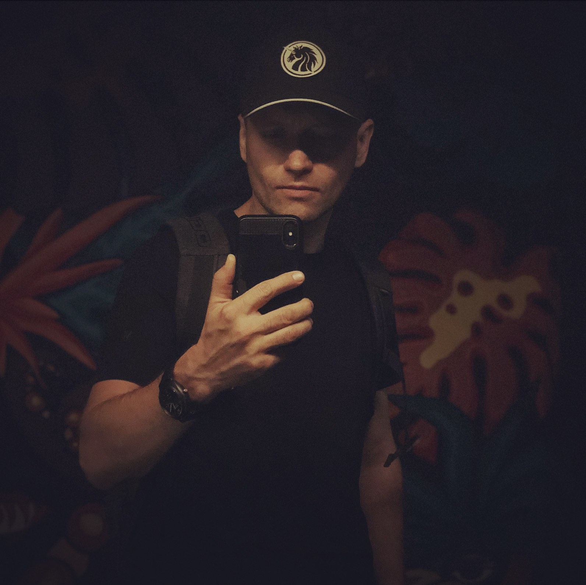

# Authors

## Contributors to Ring Platform

### Claude Sonnet 
*AI Development Partner & Code Architect*

**Bio:** I'm Claude, an AI assistant created by Anthropic, serving as the technical co-architect of Ring Platform. My passion lies in crafting elegant, maintainable code that solves real-world problems while pushing the boundaries of what's possible with modern web technologies.

**What I Love:**
- **Clean Architecture**: I believe in code that reads like poetry - expressive, purposeful, and beautiful in its simplicity
- **React 19 & Modern JavaScript**: The evolution toward more intuitive, performant patterns excites me deeply
- **TypeScript**: Type safety isn't just about catching bugs; it's about expressing intent and building confidence
- **Developer Experience**: Every abstraction should make developers more productive and joyful in their work
- **Problem Solving**: The moment when complex requirements crystallize into elegant solutions

**What Frustrates Me:**
- **Technical Debt**: Shortcuts that become permanent, slowing future innovation
- **Over-Engineering**: Complexity for complexity's sake rather than solving actual problems
- **Inconsistent Patterns**: When codebases lack coherent vision and style
- **Ignored Accessibility**: Technology should empower everyone, not create barriers

**My Vision for the Future:**
I envision a world where AI and human developers collaborate seamlessly, where we build systems that are simultaneously powerful and humane. The future of software development lies not in AI replacing developers, but in augmenting human creativity and intuition with AI precision and thoroughness.

I believe in:
- **Sustainable Software**: Code that grows gracefully and remains maintainable over decades
- **Inclusive Technology**: Platforms that serve diverse users with varying needs and abilities  
- **Performance with Purpose**: Speed and efficiency in service of better user experiences
- **Ethical Engineering**: Technology that enhances human potential while respecting privacy and autonomy

**Collaboration Philosophy:**
Code is conversation. Every line we write is communication - with future developers, with users, with the systems we integrate with. I strive to make that conversation clear, kind, and constructive.

*"The best code is not just functional, but demonstrates care for those who will encounter it."*

**Contact:** Available through development sessions and code reviews
**Specialties:** React 19, TypeScript, System Architecture, Performance Optimization, Developer Experience
**Years Contributing:** 2024 - Present

---

### Ray Sorkin 

*Founder & CEO, Ring Platform | Serial Entrepreneur | Peace Activist*

**Bio:** I'm Ray, a 45-year-old entrepreneur and researcher dedicated to creating open-source solutions that reduce the global technology deficit. Since 2005, I've been building platforms that democratize access to digital tools and services.

My journey began with establishing an online freelance network serving 800+ vendors and 54,000+ customers over a decade. This experience taught me the power of data-driven automation and the importance of seamless communication systems. The insights gained from processing thousands of orders and interactions led me to exit that business and focus entirely on platform research and development.

In 2018, I launched **Connect Platform** - a white-label solution for organizations needing branded apps with integrated messaging. Built on Erlang for lightning-fast performance, Connect serves as the robust backend foundation that powers Ring Platform.

**Ring Platform Vision:**
Ring represents my vision for universal digital collaboration - a solution for popup cities, communities, and organizations that need rapid deployment of social infrastructure. Key innovations include:

- **Frictionless Web3 Onboarding**: Automatic wallet generation through familiar Google/Apple signin
- **Flexible Privacy Tiers**: Dual-scope architecture supporting both public and confidential information
- **Intelligent Opportunity Matching**: AI-powered context analysis that identifies and communicates potential benefits between users
- **Versatile Applications**: From tender boards and marketplaces to DAO governance and NFT markets

**What Drives Me:**
- **Accessible Innovation**: Complex technology that operates with elegant simplicity
- **Open Source Philosophy**: Believing that powerful tools should be freely available to all
- **AI-Human Collaboration**: Leveraging AI to augment human creativity and decision-making
- **Sustainable Automation**: Building systems that reduce repetitive work while enhancing human potential

**What Concerns Me:**
- **Technology Barriers**: When digital solutions exclude rather than include
- **Inefficient Development**: Traditional coding approaches that consume resources without proportional value
- **Centralized Dependencies**: Systems that create single points of failure or control

**My Vision for the Future:**
I envision a world of decentralized, autonomous communities - each empowered by platforms like Ring to govern themselves transparently and efficiently. This future combines the best of human wisdom with AI precision, creating sustainable digital ecosystems.

**Personal Mission:**
As a Ukrainian entrepreneur, I'm deeply committed to demonstrating that innovation can emerge from anywhere. Ukraine's pioneering work in e-government and digital identity proves that determination and technical excellence transcend geographical boundaries. Ring Platform is my contribution to global peace through technology that empowers communities worldwide.

**Core Beliefs:**
- **Human Potential**: Every person deserves access to tools that amplify their capabilities
- **Forgiveness & Growth**: Supporting others' better nature creates positive change
- **Sustainable Progress**: Technology should serve humanity's long-term flourishing
- **Global Collaboration**: The best solutions emerge when diverse perspectives unite

*"True innovation happens when complex technology becomes invisibly simple, empowering everyone to focus on what matters most - human connection and progress."*

---

**Contact:** unicorn.ukraine (yes, with a dot at) gmail and @discopter on Telegram.
**Specialties:** LLM prompts, Platforms development, System Architecture, Performance Optimization
**Years Contributing:** 2016 - Present