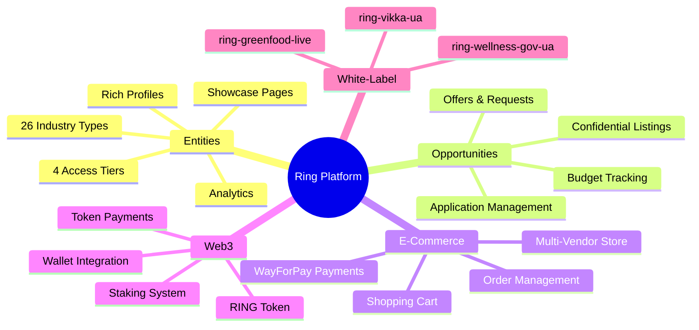
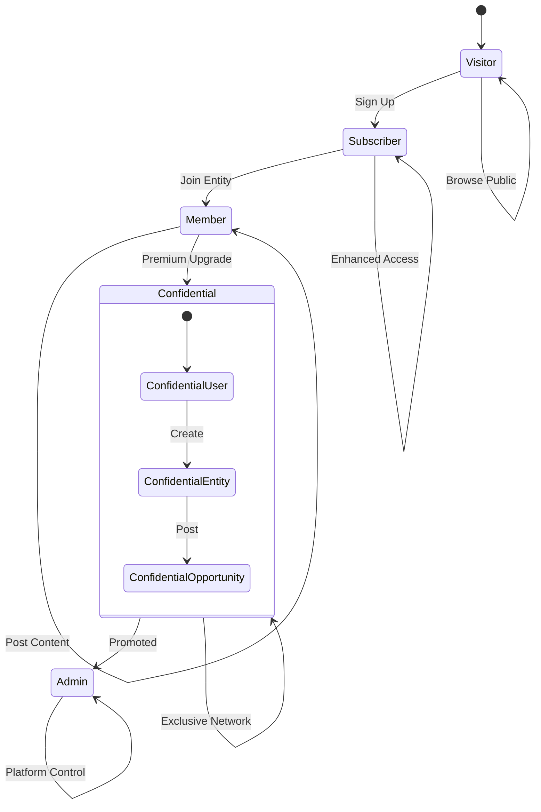
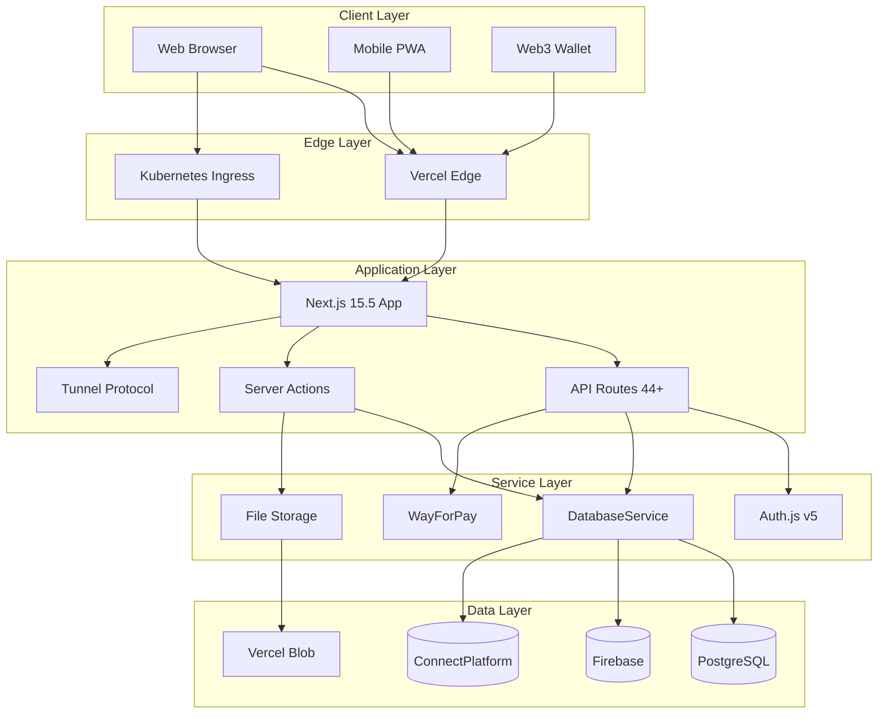
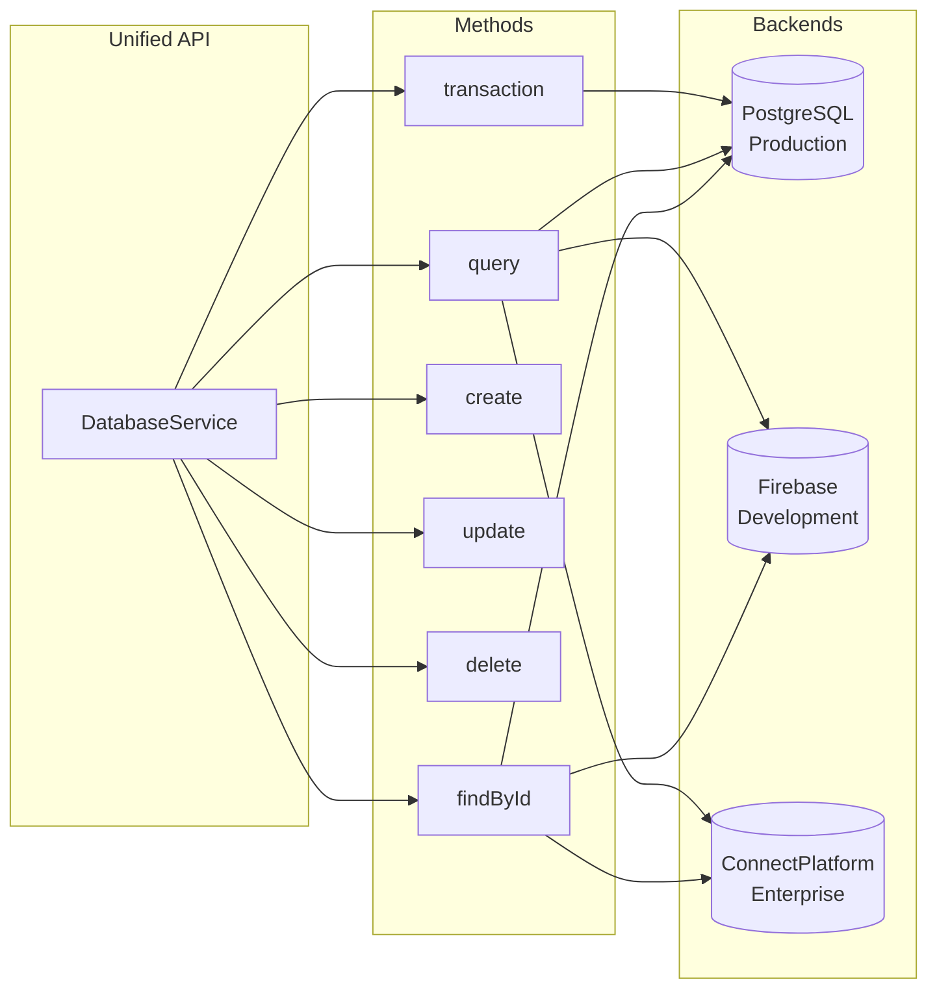
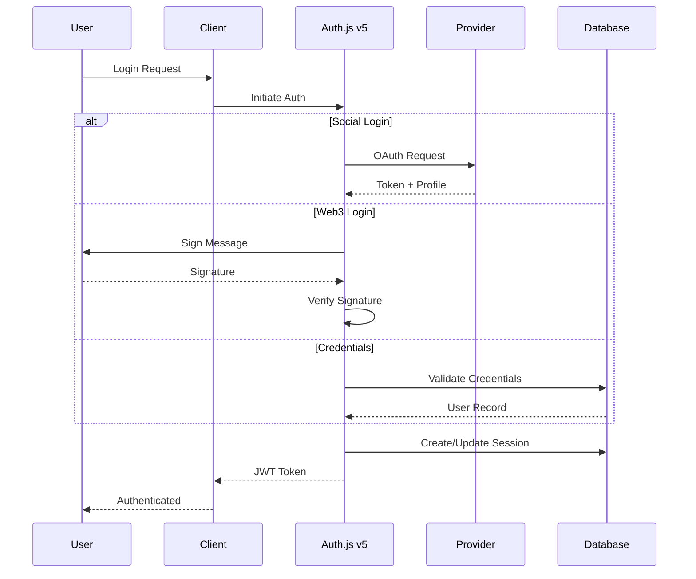
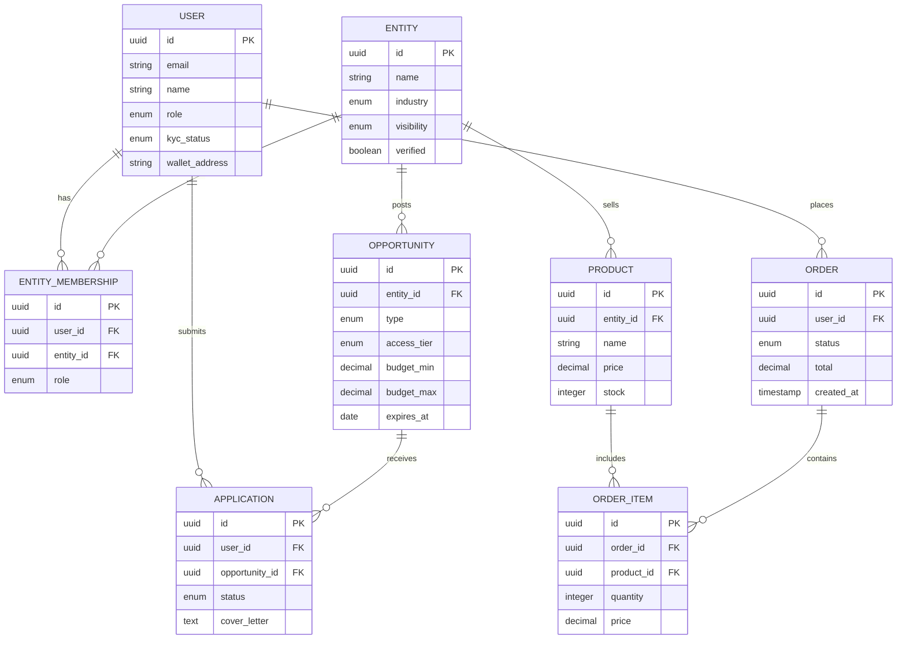
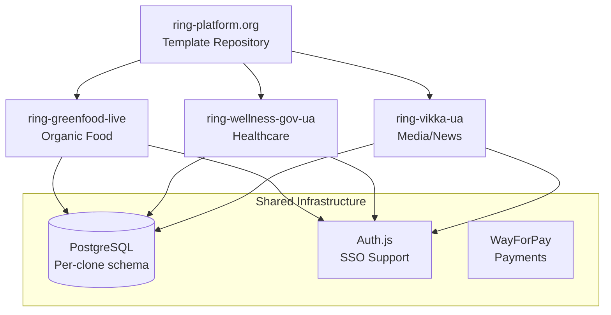
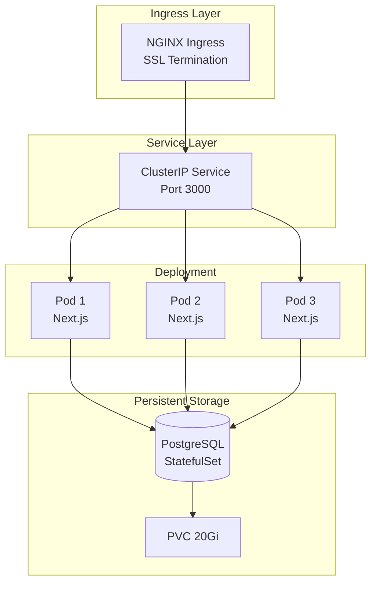
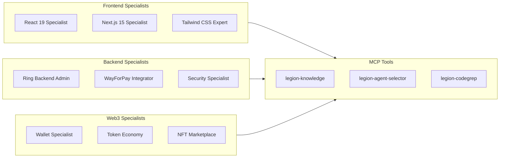

<p align="center">
  
</p>

<h1 align="center">Ring Platform</h1>

<p align="center">
  <strong>Open-Source White-Label Professional Networking Platform with Web3 Integration</strong>
</p>

<p align="center">
  <a href="#platform-overview">Overview</a> •
  <a href="#key-features">Features</a> •
  <a href="#quick-start">Quick Start</a> •
  <a href="#architecture">Architecture</a> •
  <a href="#deployment">Deployment</a> •
  <a href="#documentation">Docs</a>
</p>

<p align="center">
  
  
  
  
  
  
</p>

---

Ring Platform is a comprehensive open-source professional networking solution that connects businesses, professionals, and opportunities through a sophisticated entity-based system with confidential access tiers. Clone, customize, and deploy your own Ring-powered platform.

**Version**: 1.48 | **License**: Open Source | **Origin**: Trinity Ukraine

## What's New in 2026

- **Database Abstraction Layer** - PostgreSQL/Firebase/ConnectPlatform support via unified DatabaseService
- **Production Kubernetes** - Zero-downtime deployments with SSL, health checks, rolling updates
- **Multi-Vendor Store** - Complete e-commerce with cart, checkout, and WayForPay payments
- **White-Label Clone System** - Deploy customized Ring instances (ring-greenfood-live, ring-wellness-gov-ua)
- **Tunnel Protocol** - Real-time pub/sub replacing Firebase RTDB for K8s deployments
- **RING Token Economy** - Web3 wallet integration with token payments and staking
- **React 19.2 + Next.js 15.5** - Latest framework versions with Server Components
- **Tailwind CSS 4** - Modern utility-first styling
- **95+ Comprehensive Tests** - Enterprise-grade testing infrastructure
- **Legion AI Integration** - 136 specialized AI agents for development acceleration

## Platform Overview



Ring Platform serves as a professional networking hub where entities (companies, organizations, startups) can showcase their profiles, post opportunities, and connect with qualified professionals. The platform features a unique confidential access system that creates exclusive networking spaces for authorized businesses and professionals.

### Core Concepts

#### Entities - Professional Organizations

Entities represent professional organizations within the Ring Platform ecosystem:

- **26 Industry Types**: Technology, Finance, Healthcare, Manufacturing, Consulting, etc.
- **Visibility Tiers**: Public → Subscriber → Member → Confidential access levels
- **Rich Profiles**: Company information, team details, achievements, certifications
- **Showcase Pages**: Comprehensive multi-section layouts (Overview, Opportunities, Products, Analytics, Contact)
- **Direct Inquiries**: Embedded inquiry forms with multiple inquiry types
- **Multi-Vendor Store**: Product showcases with complete e-commerce capabilities
- **Real-time Updates**: Live opportunities and product listings via Tunnel Protocol
- **Analytics Dashboard**: Performance metrics and engagement tracking
- **Social Integration**: News articles, updates, and professional content
- **Verification System**: Enhanced credibility through verification processes
- **Wallet Integration**: RING token payments, staking, and DeFi interactions

#### Opportunities - Dual Nature System

Ring Platform supports a sophisticated dual-nature opportunity system:

**Opportunity Types:**
- **Offers**: Traditional job postings, service offerings, partnership proposals
- **Requests**: Seeking services, talent acquisition, collaboration requests
- **Ring Customization**: White-label cloning, module development, platform customization

**Access Tiers:**
- **Public**: Open to all platform users
- **Subscriber**: Requires platform subscription
- **Member**: Entity membership required
- **Confidential**: Exclusive access for confidential members only

**Key Features:**
- Budget ranges and compensation details
- Location flexibility (remote, hybrid, onsite)
- Expiration management and renewal
- Application tracking and management
- Advanced filtering and search capabilities

#### Professional Access Control System



Ring Platform implements a tiered access model for professional networking:

**Access Levels:**
- **Visitor**: Basic platform browsing
- **Subscriber**: Enhanced access to content and opportunities
- **Member**: Entity membership with posting privileges
- **Confidential**: Premium tier with exclusive access
- **Admin**: Platform administration and management

#### Confidential Access - Premium Tier

**CONFIDENTIAL Account Status:**
- **Confidential users** can create **confidential entities**
- **Confidential entities** can create **confidential opportunities** on behalf of their organization
- **Exclusive Content**: Confidential opportunities typically contain C-level positions, stealth startups, M&A activities, strategic partnerships, and investment opportunities
- **Enhanced Security**: Confidential entities are only visible to confidential members, and confidential opportunities are only visible to confidential members
- **Business Value**: Creates an exclusive area of information exchange for authorized businesses and professionals, facilitating high-level networking, executive recruitment, strategic partnerships, and investment opportunities

### Technology Stack

| Category | Technology |
|----------|------------|
| **Frontend** | Next.js 15.5.4, React 19.2, TypeScript 5.9.3 |
| **Authentication** | Auth.js v5 (NextAuth) with Google, Apple, MetaMask, Credentials |
| **Database** | PostgreSQL (production) / Firebase Firestore / ConnectPlatform |
| **Database Abstraction** | Unified DatabaseService with automatic backend selection |
| **Styling** | Tailwind CSS 4.1 with custom design system |
| **Web3** | wagmi 2.18, viem 2.38, RainbowKit 2.2, RING Token |
| **Real-time** | Tunnel Protocol (WebSocket) / Firebase RTDB |
| **File Storage** | Vercel Blob / Filebase (S3-compatible) |
| **Payments** | WayForPay integration with PCI-DSS compliance |
| **Deployment** | Kubernetes / Vercel with edge functions |
| **Testing** | Jest 30 + React Testing Library 16 (95+ tests) |
| **Internationalization** | next-intl with EN, UK, RU support |
| **Animations** | Framer Motion 12 |
| **3D Graphics** | Three.js / React Three Fiber |

### Platform Statistics

- **Version**: 1.48 (production-ready)
- **API Endpoints**: 44+ documented endpoints
- **Routes**: 58+ application routes
- **Build Time**: ~17 seconds (optimized)
- **Bundle Size**: 260kB (55KB reduction via React 19 optimization)
- **Test Coverage**: 95+ comprehensive tests
- **Radix UI Components**: 27+ accessible components
- **Supported Languages**: English, Ukrainian, Russian

## Key Features

### System Architecture



### White-Label Clone System
- **One-Command Cloning**: Deploy your own Ring platform instance
- **Active Clones**: ring-greenfood-live (organic food marketplace), ring-wellness-gov-ua, ring-vikka-ua
- **Customization**: Theme, branding, modules, and features per clone
- **Shared Infrastructure**: PostgreSQL database per clone with global user support
- **Kubernetes Deployments**: Production-ready with SSL, replicas, and health checks

### Multi-Vendor E-Commerce
- **Complete Store System**: Product catalog, variants, pricing tiers
- **Shopping Cart**: Persistent cart with mini-cart, quantity management
- **Checkout Flow**: Multi-step checkout with address and payment handling
- **WayForPay Integration**: PCI-DSS compliant payment processing with HMAC validation
- **Vendor Dashboard**: Product management, order tracking, analytics
- **Order Management**: Status tracking, fulfillment workflows
- **Store Filtering**: Advanced filters by category, price, vendor, availability

### Professional Networking
- **Entity Profiles**: Comprehensive company and organization profiles
- **Enhanced Showcase Pages**: Multi-section entity displays with opportunities, products, analytics, and contact forms
- **Direct Inquiry System**: Embedded forms for partnership inquiries, collaborations, and support requests
- **Store Integration**: E-commerce capabilities with product showcases and RING token payments
- **Real-time Opportunities**: Live listings with deadline tracking and application management
- **Analytics Dashboard**: Performance metrics and engagement tracking for entities
- **Opportunity Management**: Advanced job posting and service request system
- **Professional Discovery**: Find companies, opportunities, and professionals
- **Networking Tools**: Connect with industry professionals and organizations

### Web3 & Token Economy
- **RING Token**: Native platform token for payments, staking, governance
- **Wallet Integration**: MetaMask, RainbowKit, one-click wallet creation
- **Token Payments**: Pay for services, subscriptions, and products with RING
- **NFT Marketplace**: Digital asset creation and trading (planned)
- **Staking System**: Earn rewards by staking RING tokens
- **Web3 Authentication**: Sign in with Ethereum wallet

### Database Abstraction Layer



- **Unified DatabaseService**: Single API for all database backends
- **PostgreSQL Backend**: Production Kubernetes deployments
- **Firebase Backend**: Vercel/development deployments
- **ConnectPlatform Backend**: Enterprise real-time backend
- **Automatic Selection**: Backend selected based on environment
- **Transaction Support**: ACID-compliant transactions via `db.transaction()`
- **Query API**: Unified filters, pagination, ordering across backends

### Real-time Tunnel Protocol
- **WebSocket Pub/Sub**: Real-time updates replacing Firebase RTDB
- **Channel Subscriptions**: Subscribe to specific data channels
- **publishToTunnel()**: Server-side publishing for instant client updates
- **Auto-Reconnection**: Heartbeat mechanism with connection recovery
- **<100ms Latency**: Near-instant notification delivery

### Confidential Business Network
- **Exclusive Access**: Premium tier for confidential business interactions
- **Executive Opportunities**: C-level positions and strategic roles
- **Stealth Operations**: Support for stealth startups and confidential projects
- **Strategic Partnerships**: Facilitate high-level business collaborations
- **Investment Opportunities**: Connect investors with exclusive deals

### Advanced Search & Discovery
- **Multi-Criteria Filtering**: Industry, location, budget, experience level
- **Geolocation Support**: Location-based opportunity discovery
- **AI-Powered Matching**: Smart recommendations via Legion AI Matcher
- **Real-time Updates**: Live notifications for new opportunities
- **WebSocket Push**: Instant notification delivery (<100ms latency)
- **Stable Connections**: Centralized subscription management prevents loops
- **Connection Reliability**: Heartbeat mechanism with auto-reconnection

### Enhanced Authentication System



- **Auth.js v5**: Latest NextAuth with multi-provider support
- **Social Login**: Google, Apple ID integration
- **Web3 Login**: MetaMask and Ethereum wallet authentication
- **Type-Safe Roles**: Hierarchical access control with UserRole enum
- **KYC Workflow**: Integrated identity verification status tracking
- **Session Security**: IP-bound auth cache with hijacking prevention

### Content Management & Engagement
- **News System**: Industry news, company updates, and professional insights
- **News Likes**: React 19 optimistic updates for instant engagement feedback
- **Comments System**: Nested comments with 3-level deep threading for discussions
- **Review & Rating**: Star ratings, photo uploads, helpful votes
- **File Management**: Document upload via Vercel Blob / Filebase
- **Rich Media**: Support for images, videos, and presentations
- **Content Categorization**: Organized content discovery

### Analytics & Monitoring
- **Web Vitals Tracking**: LCP, CLS, FCP, TTFB, INP monitoring
- **Real-time Analytics**: Comprehensive user behavior tracking
- **Business Intelligence**: Entity interaction and engagement metrics
- **Error Monitoring**: ES2022 Error.cause with full cause chain debugging
- **Performance Scoring**: Intelligent scoring based on Core Web Vitals
- **Navigation Analytics**: User journey tracking and session management

### Security & Privacy
- **Enterprise Security**: Rate limiting (5 auth/min, 100 API/min per IP)
- **CORS Protection**: Environment-specific origins, no wildcards
- **Input Validation**: XSS prevention and sanitization
- **GDPR/CCPA Compliant**: Account deletion with 30-day grace period
- **Audit Logging**: Comprehensive activity tracking
- **HMAC Webhooks**: Secure payment callback validation

## Architecture

### Application Structure

```
ring-platform.org/
├── app/                    # Next.js 15 App Router
│   ├── (main)/            # Main application routes
│   ├── api/               # API endpoints (44+ total)
│   └── actions/           # React 19 Server Actions
├── components/            # Reusable UI components (27+ Radix)
├── features/              # Feature-specific modules
│   ├── auth/              # Authentication services
│   ├── store/             # E-commerce system
│   ├── entities/          # Entity management
│   └── opportunities/     # Opportunity system
├── services/              # Business logic services
├── lib/                   # Utility libraries
│   ├── database/          # DatabaseService abstraction
│   ├── payments/          # WayForPay integration
│   └── tunnel/            # Real-time protocol
├── types/                 # TypeScript definitions
├── locales/               # i18n translations (en, uk, ru)
├── cli/                   # Ring CLI tool
└── k8s/                   # Kubernetes manifests
```

### Database Architecture



**DatabaseService API:**

```typescript
// Unified API across all backends
await initializeDatabase()
const db = getDatabaseService()

// CRUD Operations
const user = await db.findById('users', userId)
const products = await db.query({ collection: 'store_products', filters: [...] })
await db.create('orders', orderData)
await db.update('users', { id: userId, data: updates })

// Transactions (PostgreSQL - ACID compliant)
await db.transaction(async (txn) => {
  await txn.update('users', { id: userId, data: { balance: newBalance }})
  await txn.create('transactions', { userId, amount, type: 'payment' })
})
```

### White-Label Clone Architecture



### API Architecture
- **RESTful Design**: Standard HTTP methods and status codes
- **Server Actions**: React 19 useActionState for mutations
- **Direct Service Calls**: Server components use services directly
- **Client-Server Separation**: Client components use API routes
- **Rate Limiting**: 5 auth/min, 100 API/min per IP
- **Error Handling**: ES2022 Error.cause with cause chains
- **API Client**: RingApiClient with timeout, retry, error handling

## Business Model

### Revenue Streams
- **Subscription Tiers**: Freemium model with premium features
- **Confidential Access**: Premium tier for exclusive networking
- **RING Token Economy**: Token payments, staking rewards, governance
- **White-Label Licensing**: Clone deployment and customization services
- **Entity Verification**: Enhanced credibility services
- **Featured Listings**: Promoted opportunity placements
- **Multi-Vendor Marketplace**: Transaction fees on store sales
- **Enterprise Solutions**: Custom solutions for large organizations

### Target Markets
- **Technology Companies**: Startups to enterprise organizations
- **E-Commerce**: Multi-vendor marketplace operators
- **Professional Services**: Consulting, legal, financial services
- **Healthcare Organizations**: Hospitals, clinics, research institutions
- **Food & Agriculture**: Organic food marketplaces (ring-greenfood-live)
- **Investment Firms**: VCs, private equity, and investment banks
- **Government & NGOs**: Public service platforms (ring-wellness-gov-ua)

## Development

### Quick Start (One Command)

```bash
# Clone and install in one command
git clone https://github.com/connectplatform/ring.git && cd ring && ./install.sh
```

The interactive installer will:
1. Check system requirements (Node.js 20+, npm, Git)
2. Configure your clone name and branding
3. Create `ring-config.json` for customization
4. Generate `.env.local` with secure secrets
5. Install all dependencies
6. Set up configuration files

### Manual Installation

```bash
# Clone the repository
git clone https://github.com/connectplatform/ring.git
cd ring

# Install dependencies
npm install

# Copy environment template
cp env.local.template .env.local

# Copy clone configuration template
cp ring-config.template.json ring-config.json

# Configure your settings in .env.local and ring-config.json

# Run development server
npm run dev
```

### Installation Options

```bash
./install.sh                      # Interactive installation
./install.sh --quick              # Quick setup with defaults
./install.sh --clone-name myapp   # Set clone name directly
./install.sh --help               # Show all options
```

### Environment Configuration

```env
# Authentication (Auth.js v5)
AUTH_SECRET=your-secret-key
NEXTAUTH_URL=http://localhost:3000

# Database Configuration (choose backend)
# PostgreSQL (production/K8s)
POSTGRES_HOST=localhost
POSTGRES_PORT=5432
POSTGRES_DB=ring_platform
POSTGRES_USER=ring_user
POSTGRES_PASSWORD=your-password

# Firebase (development/Vercel)
FIREBASE_PROJECT_ID=your-project-id
FIREBASE_CLIENT_EMAIL=your-service-account-email
FIREBASE_PRIVATE_KEY=your-private-key

# File Storage
BLOB_READ_WRITE_TOKEN=your-vercel-blob-token
# Or Filebase (S3-compatible)
FILEBASE_ACCESS_KEY=your-access-key
FILEBASE_SECRET_KEY=your-secret-key
FILEBASE_BUCKET=your-bucket

# Payments (WayForPay)
WAYFORPAY_MERCHANT_ACCOUNT=your-merchant-account
WAYFORPAY_SECRET_KEY=your-secret-key
WAYFORPAY_DOMAIN=https://your-domain.com

# Web3
NEXT_PUBLIC_WALLETCONNECT_PROJECT_ID=your-project-id

# External APIs
GOOGLE_CLIENT_ID=your-google-client-id
GOOGLE_CLIENT_SECRET=your-google-client-secret
```

### Available Scripts

```bash
# Development
npm run dev          # Start development server
npm run dev:ws       # Start with WebSocket support
npm run type-check   # Run TypeScript type checking

# Building
npm run build        # Build for production with type validation
npm run build:skip-types # Build without type validation
npm run build:clean  # Clean build with fresh start
npm run analyze      # Analyze bundle size

# Testing
npm run test         # Run test suite (95+ tests)
npm run test:watch   # Run tests in watch mode
npm run test:coverage # Run tests with coverage report

# Production
npm run start        # Start production server

# Utilities
npm run lint         # Run ESLint
npm run setup        # Set up environment configuration
npm run seed:portal  # Seed initial data
```

## Security

### Enterprise-Grade Security Features
- **Rate Limiting**: 5 auth/min, 100 API/min, 10 WebSocket/min per IP
- **CORS Protection**: Environment-specific origins, no wildcards
- **Input Validation**: XSS prevention and sanitization
- **Session Security**: IP-bound auth cache with hijacking prevention
- **Token Validation**: JWT expiry checks with clock skew protection
- **Subscription Security**: Centralized context prevents duplicate subscriptions
- **Error Handling**: Generic messages prevent information leakage

### Security Testing

```bash
# Test rate limiting
for i in {1..10}; do curl http://localhost:3000/api/websocket/auth; done

# Test CORS protection
curl -H "Origin: https://evil.com" http://localhost:3000/api/notifications

# Check security headers
curl -I http://localhost:3000/api/notifications
```

## Ring CLI

Ring Platform includes a powerful command-line interface for deployment and configuration management.

### Installation

```bash
# Install CLI globally
./install-cli.sh

# Or install manually
npm run cli:install
```

### Production Deployment (Kubernetes)


```bash
# Deploy to production (builds, pushes, deploys to K8s)
ring --prod

# Deploy specific version
ring --prod --version 1.48

# Skip certain steps
ring --prod --skip-build  # Only push and deploy
ring --prod --skip-deploy # Only build and push
```

### Configuration Management

```bash
# Set configuration values
ring config --set k8s.controlNode=k8s-control-01
ring config --set database.host=postgres.example.com
ring config --set app.url=https://my-ring-instance.com

# Get configuration values
ring config --get k8s.namespace

# List all configuration
ring config --list

# Reset to defaults
ring config --reset
```

### Status Monitoring

```bash
# Check deployment status
ring status
```

**Features:**
- **One-command deployment** to Kubernetes production
- **Zero-downtime rolling updates** with readiness probes
- **Configuration management** for multiple environments
- **Status monitoring** of all services and pods
- **Version management** from package.json
- **Docker image tagging**: `v{version}-{project}-amd64`

### Deployment Architecture



## White-Label Cloning

### Creating a New Ring Clone

```bash
# 1. Clone the template
git clone https://github.com/connectplatform/ring.git my-ring-clone
cd my-ring-clone

# 2. Configure for your brand
# Edit ring-config.json with your branding
# Update locales/ with your translations
# Customize theme in tailwind.config.ts

# 3. Set up database
# Create PostgreSQL schema: my_ring_clone
# Run migrations: npm run migrate

# 4. Deploy to Kubernetes
ring config --set app.name=my-ring-clone
ring config --set app.url=https://my-ring-clone.com
ring --prod
```

### Active Ring Clones

| Clone | Domain | Purpose |
|-------|--------|---------|
| ring-greenfood-live | app.greenfood.live | Organic food marketplace |
| ring-wellness-gov-ua | wellness.gov.ua | Healthcare platform |
| ring-vikka-ua | vikka.ua | Media/News portal |
| ring-platform.org | ring-platform.org | Main portal/template |

## Documentation

### API Documentation
- **Interactive Docs**: [connectplatform.github.io/ring](https://connectplatform.github.io/ring)
- **API Reference**: Comprehensive endpoint documentation
- **Code Examples**: Multiple language examples
- **Postman Collection**: Ready-to-use API collection

### Developer Resources
- **Setup Guides**: Environment configuration and deployment
- **Architecture Docs**: System design and patterns
- **API Client Guide**: RingApiClient integration and best practices
- **Security Guide**: [Security Implementation Guide](docs/SECURITY-IMPLEMENTATION-GUIDE.md)
- **Contributing Guide**: Development workflow and standards
- **Security Guidelines**: Best practices and compliance

## Contributing

We welcome contributions to Ring Platform! Please see our [Contributing Guide](CONTRIBUTING.md) for details on:

- **Development Workflow**: Git flow and branch management
- **Code Standards**: TypeScript, React, and Next.js best practices
- **Testing Requirements**: Unit tests and integration tests
- **Documentation**: API docs and code documentation
- **Security**: Security review process and guidelines

## Legion AI Integration

Ring Platform is developed with Legion AI - a sophisticated AI development system with 136 specialized agents.

### Key Legion Agents for Ring



- **React 19 Specialist** - Server Components, useActionState, useOptimistic patterns
- **Next.js 15 Specialist** - App Router, edge runtime, async APIs
- **Ring Backend Administrator** - DatabaseService API, transactions, migrations
- **WayForPay Integrator** - Payment integration, PCI-DSS compliance
- **Ring Web3 & Wallet Specialist** - RING tokens, wallet integration, staking
- **Multi-Vendor Store Expert** - E-commerce, cart, checkout flows

### 21 MCP Tools
- `legion-knowledge` - Query AI-CONTEXT knowledge base (2ms)
- `legion-agent-selector` - Select optimal agent for task (5ms)
- `legion-codegrep` - Kingdom-wide code search (5ms)
- `legion-context-update` - Sync empire knowledge
- And 17 more specialized tools...

## Trinity Ukraine

Ring Platform is a gift from Trinity Ukraine to the world - built during Ukraine's struggle for independence.

**Mission**: Create the world's most comprehensive free open-source platform for solving human needs collectively with AI orchestration.

**Vision**: Democratic access to technology, autonomous platform evolution, and global peace through digital collaboration.

**Origin**: Developed by Emperor Ray and Legion Commander, with complete AI-CONTEXT knowledge and zero-flaw execution principles.

## License

Ring Platform is **open source software**. Clone, customize, and deploy your own Ring-powered platform.

## Links

- **Main Platform**: [ring-platform.org](https://ring-platform.org)
- **Documentation**: [connectplatform.github.io/ring](https://connectplatform.github.io/ring)
- **API Reference**: [ring-platform.org/docs/api](https://ring-platform.org/docs/api)
- **GitHub**: [github.com/connectplatform/ring](https://github.com/connectplatform/ring)
- **Live Clones**:
  - [app.greenfood.live](https://app.greenfood.live) - Organic Food Marketplace
  - [ring-platform.org](https://ring-platform.org) - Main Portal

---

<p align="center">
  <em>Ring Platform - Connecting Professionals, Empowering Businesses, Enabling Opportunities</em>
</p>

<p align="center">
  <strong>Version 1.48</strong> | <strong>React 19.2</strong> | <strong>Next.js 15.5</strong> | <strong>TypeScript 5.9</strong> | <strong>Tailwind 4.1</strong>
</p>

<p align="center">
  <em>Built with Legion AI - 136 Agents, 21 MCP Tools, Zero Flaws</em>
</p>
