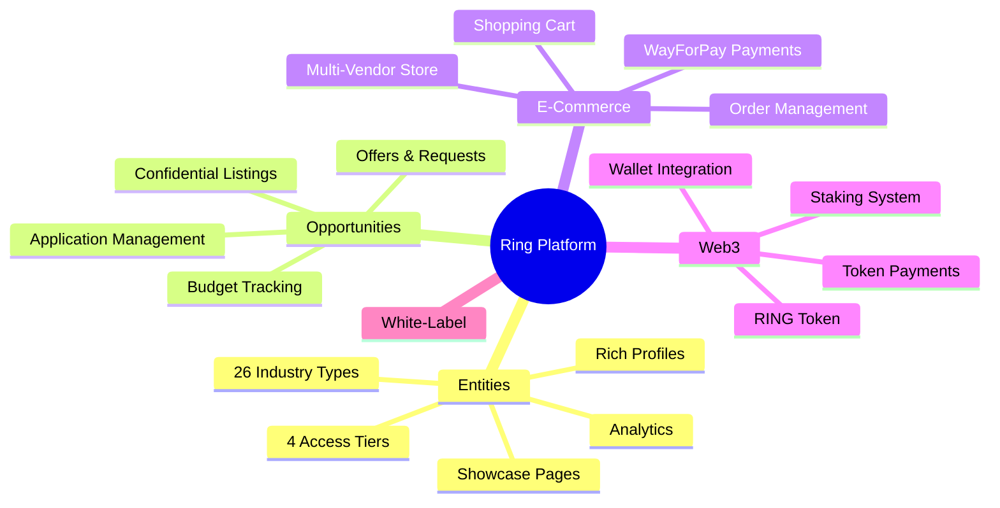
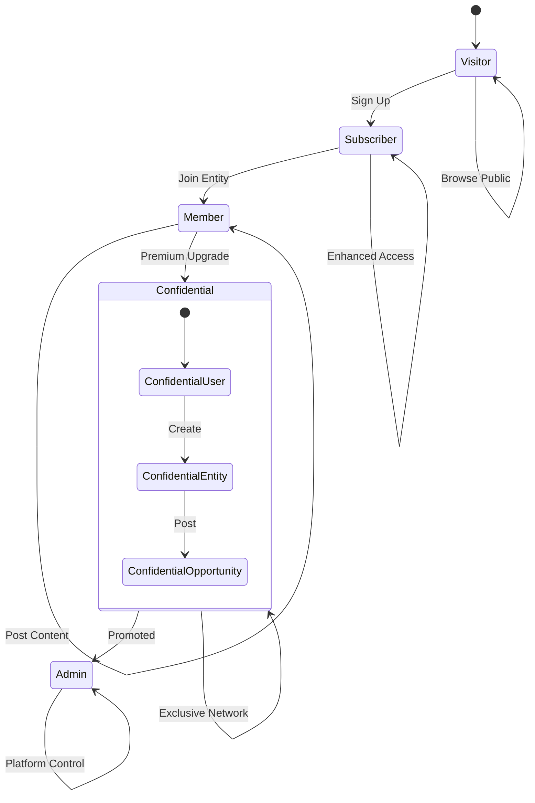
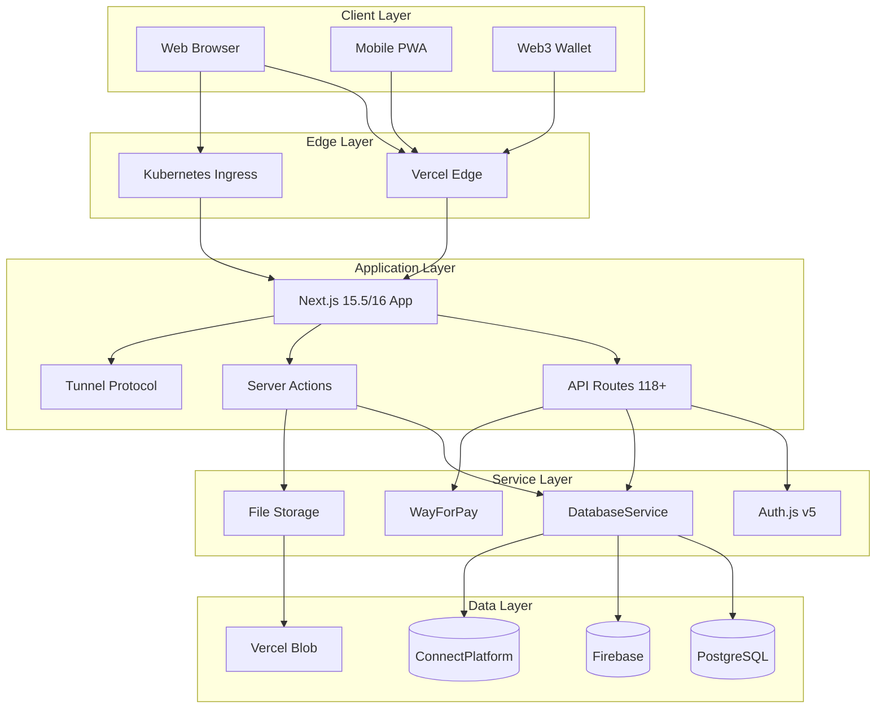
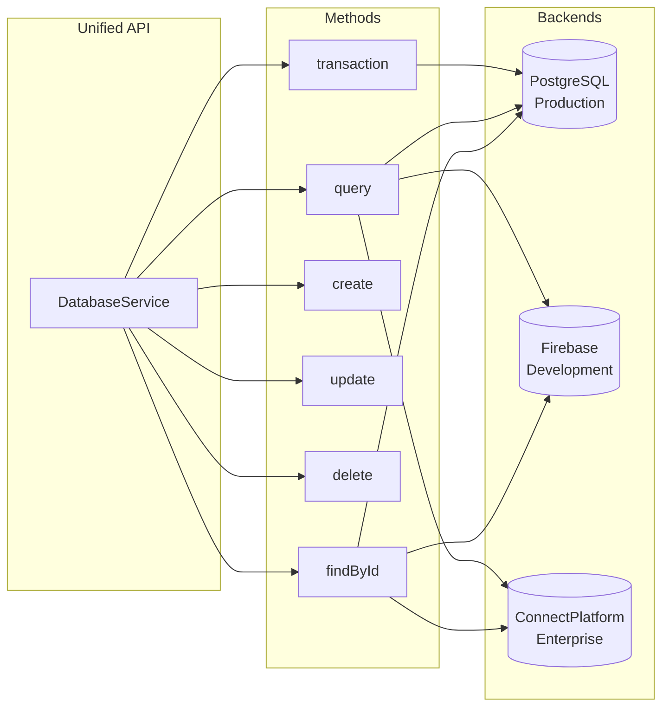
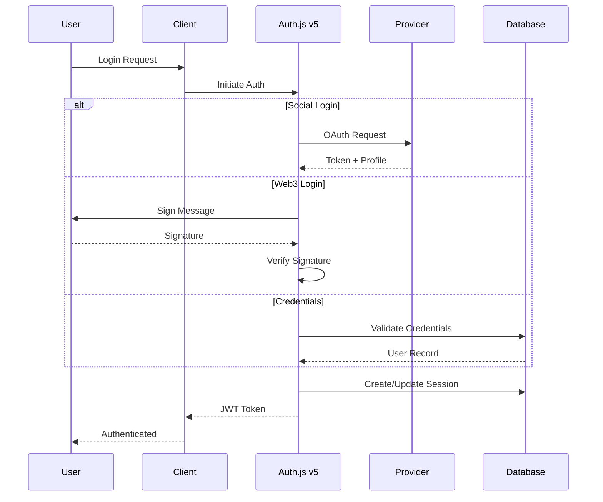
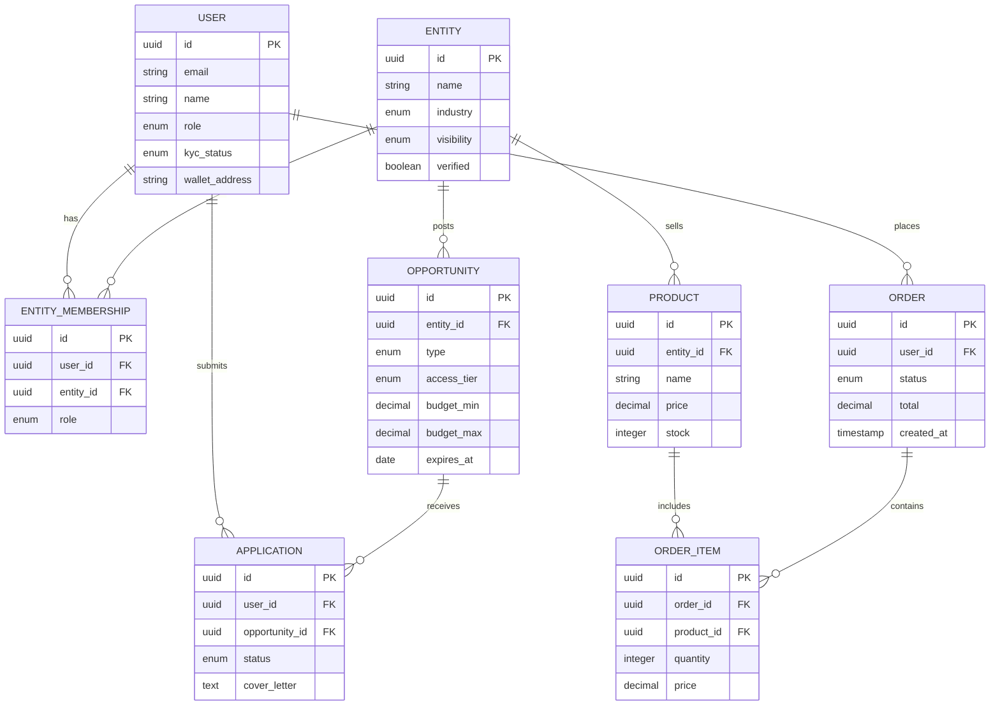
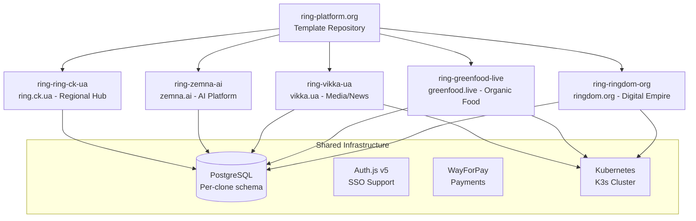
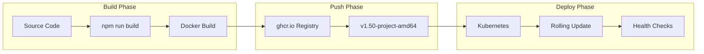
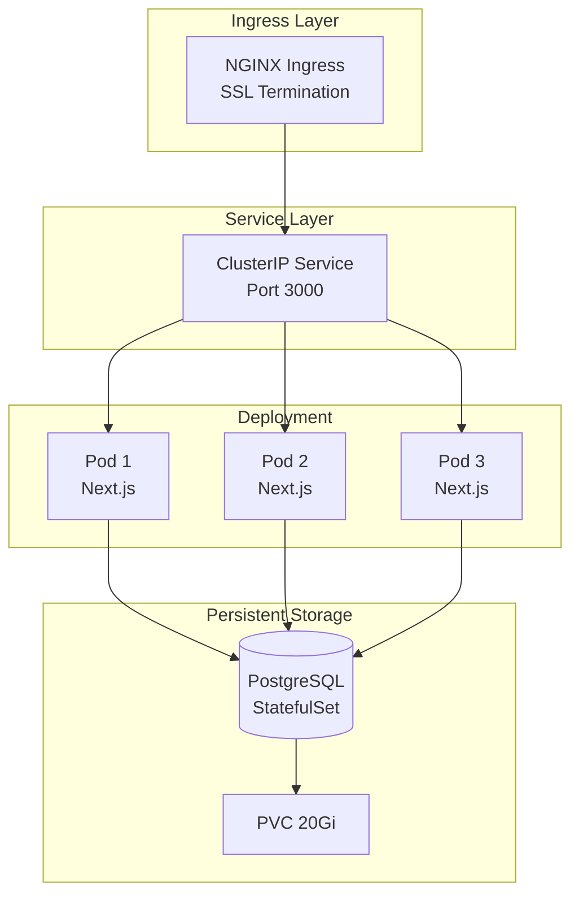
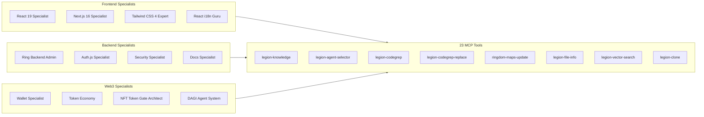

<p align="center">
  
</p>

<h1 align="center">Ring Platform</h1>

<p align="center">
  <strong>The World's First AI-Self-Construct White-Label Multi-Use Platform for Global Abundance</strong>
</p>

<p align="center">
  <a href="#ringdom-ecosystem">Ringdom</a> •
  <a href="#platform-overview">Overview</a> •
  <a href="#key-features">Features</a> •
  <a href="#quick-start">Quick Start</a> •
  <a href="#architecture">Architecture</a> •
  <a href="#legion-nft-access">Legion NFT</a> •
  <a href="#documentation">Docs</a>
</p>

<p align="center">
  
  
  
  
  
  
  
  
  
</p>

---

Ring Platform is the largest, most versatile, and most thoroughly engineered all-in-one open-source platform on planet Earth. It is a React 19-native, Next.js 16, AI-self-construct white-label technology that powers communities and projects everywhere. Clone it, customize it, deploy it -- for free, forever.

Ring Platform is the core technology of **[Ringdom](https://ringdom.org)** -- the First Digital Kingdom for global abundance. While this repository gives you the full open-source codebase, Ringdom offers the turn-key experience: AI customization via Legion, enterprise-grade K8s hosting in your country or anywhere, and an AI assistant named **Reggie** who will "ringize" your project requirements into a deployment plan with forecasted costs.

**Version**: 1.50 | **License**: Open Source | **Origin**: Built by Ray Sorkin, a free person of Ukraine

## Ringdom Ecosystem

Ring Platform exists within **Ringdom** -- the First Digital Kingdom offered to humanity for global abundance.

### How It Works

| Path | For Whom | What You Get |
|------|----------|-------------|
| **Clone it yourself** | Developers, open-source enthusiasts | Full codebase from this repo. `git clone`, customize, deploy to your own infra. Free forever. |
| **Become a Ringdom Settler** | Communities, organizations, startups | Register at [ringdom.org/settler](https://ringdom.org/settler), talk to **Reggie** (Ringdom AI Assistant), describe your project. Reggie "ringizes" your request into a Ring Platform Customization Plan with forecasted costs. Ringdom handles AI customization, K8s hosting, and ongoing support. |
| **Get Legion AI Skillsets** | AI developers using Cursor IDE | 147+ Ring-specialized AI agent skillsets, installable as a Cursor Plugin. Access gated by **Ringdom Legion-Access NFT** (ERC-721 on Polygon). Perpetual license -- own the NFT, access the skillsets indefinitely. |

### The Ringdom Stack

```
Ringdom.org (Turn-key service layer)
  |-- Ring Platform (This open-source codebase)
  |-- Legion AI (147+ specialized agents, 23 MCP tools)
  |-- K8s Infrastructure (Enterprise hosting, any country)
  |-- Reggie (AI assistant for project ringization)
  |-- Legion-Access NFT (Token-gated skillset distribution)
```

### Settler Tiers

| Tier | Investment | RING Tokens | What's Included |
|------|-----------|-------------|-----------------|
| Pioneer Settler | $100 | 1,000 RNG | Ring clone + basic customization |
| Founding Settler | $500 | 5,000 RNG | Ring clone + full AI customization + priority support |
| Empire Builder | $1,000+ | 10,000+ RNG (with bonus) | Ring clone + enterprise customization + dedicated hosting + Legion support |

## What's New in 2026

- **Next.js 16** - Turbopack default, async params, proxy.ts middleware, `revalidateTag` 2-arg API (ring-ringdom-org live on Next 16)
- **ALL React 19 Features** - Server Components, useActionState, useOptimistic, useFormStatus, React Compiler, `use()`, Activity, View Transitions
- **DAGI AI Agent System** - 3-tier autonomous AI agents with 7-agent multi-agent coordination and provisioning API
- **Ringdom Settler System** - Complete registration flow with tier selection, token calculator, checkout, and Reggie AI ringization
- **Legion-Access NFT** - ERC-721 token-gated access to Legion AI skillsets as Cursor Plugin (dual-layer verification, EIP-712 signatures)
- **Interactive Maps & Visualization** - Feature map, timeline, dataflow, knowledge graph via @xyflow/react
- **News Module** - Complete digital newspaper with likes, categories, analytics, SEO, newsletter distribution
- **Email CRM System** - IMAP listener, contact management, newsletter automation
- **PIN Security System** - Revolutionary Web3 without seed phrases (95% wallet connection vs 40% industry standard)
- **Auth Route Standardization** - ROUTES.LOGIN(locale) canonical pattern, unified query params (from/callbackUrl/returnTo)
- **6+ Active Ring Clones** - ringdom.org, greenfood.live, vikka.ua, zemna.ai, ring.ck.ua, gopadel.now on Kubernetes
- **Database Abstraction Layer** - PostgreSQL/Firebase/ConnectPlatform via unified DatabaseService
- **Multi-Vendor Store** - Complete e-commerce with cart, checkout, and WayForPay payments
- **Tunnel Protocol** - Real-time pub/sub replacing Firebase RTDB for K8s deployments
- **RING Token Economy** - Web3 wallet integration with token payments and staking
- **BERT/NLP Semantic Search** - AI-powered opportunity matching with vector embeddings
- **3-Level Comment Threading** - Nested discussion system with optimistic updates
- **Tailwind CSS 4** - Modern utility-first styling
- **12 Test Suites** - Enterprise-grade testing infrastructure
- **Legion AI 147+ Agents** - Cohort-based hierarchy with 23 MCP tools

## Platform Overview



Ring Platform serves as a professional networking hub where entities (companies, organizations, startups) can showcase their profiles, post opportunities, and connect with qualified professionals. The platform features a unique confidential access system that creates exclusive networking spaces for authorized businesses and professionals.

### Core Concepts

#### Entities - Professional Organizations

Entities represent professional organizations within the Ring Platform ecosystem:

- **26 Industry Types**: Technology, Finance, Healthcare, Manufacturing, Consulting, etc.
- **Visibility Tiers**: Public → Subscriber → Member → Confidential access levels
- **Rich Profiles**: Company information, team details, achievements, certifications
- **Showcase Pages**: Comprehensive multi-section layouts (Overview, Opportunities, Products, Analytics, Contact)
- **Direct Inquiries**: Embedded inquiry forms with multiple inquiry types
- **Multi-Vendor Store**: Product showcases with complete e-commerce capabilities
- **Real-time Updates**: Live opportunities and product listings via Tunnel Protocol
- **Analytics Dashboard**: Performance metrics and engagement tracking
- **Social Integration**: News articles, updates, and professional content
- **Verification System**: Enhanced credibility through verification processes
- **Wallet Integration**: RING token payments, staking, and DeFi interactions

#### Opportunities - Dual Nature System

Ring Platform supports a sophisticated dual-nature opportunity system:

**Opportunity Types:**
- **Offers**: Traditional job postings, service offerings, partnership proposals
- **Requests**: Seeking services, talent acquisition, collaboration requests
- **Ring Customization**: White-label cloning, module development, platform customization
- **Partnership**: Strategic partnerships and joint ventures
- **Mentorship**: Experienced Ring deployers mentor newcomers
- **Resource**: Shared resources, tools, and infrastructure
- **Event**: Community events, hackathons, meetups
- **Volunteer**: Contributing to Ring ecosystem development

**Access Tiers:**
- **Public**: Open to all platform users
- **Subscriber**: Requires platform subscription
- **Member**: Entity membership required
- **Confidential**: Exclusive access for confidential members only

**Key Features:**
- Budget ranges and compensation details
- Location flexibility (remote, hybrid, onsite)
- Expiration management and renewal
- Application tracking and management
- Advanced filtering and search capabilities

#### Professional Access Control System



Ring Platform implements a tiered access model for professional networking:

**Access Levels:**
- **Visitor**: Basic platform browsing
- **Subscriber**: Enhanced access to content and opportunities
- **Member**: Entity membership with posting privileges
- **Confidential**: Premium tier with exclusive access
- **Admin**: Platform administration and management

#### Confidential Access - Premium Tier

**CONFIDENTIAL Account Status:**
- **Confidential users** can create **confidential entities**
- **Confidential entities** can create **confidential opportunities** on behalf of their organization
- **Exclusive Content**: Confidential opportunities typically contain C-level positions, stealth startups, M&A activities, strategic partnerships, and investment opportunities
- **Enhanced Security**: Confidential entities are only visible to confidential members, and confidential opportunities are only visible to confidential members
- **Business Value**: Creates an exclusive area of information exchange for authorized businesses and professionals, facilitating high-level networking, executive recruitment, strategic partnerships, and investment opportunities

### Technology Stack

| Category | Technology |
|----------|------------|
| **Frontend** | Next.js 16.1 (Turbopack, async params, proxy.ts), React 19.2 (ALL features), TypeScript 5.9.3 |
| **React 19** | Server Components, useActionState, useOptimistic, useFormStatus, React Compiler, `use()`, Activity, View Transitions |
| **Authentication** | Auth.js v5 -- Google GIS, Apple, MetaMask, Magic Links, PIN Security, split config (edge + server) |
| **Database** | PostgreSQL (K8s production) / Firebase Firestore / ConnectPlatform -- unified DatabaseService |
| **Styling** | Tailwind CSS 4.1 with custom design system, Radix UI 26 components |
| **Web3** | wagmi 2.18, viem 2.38, RainbowKit 2.2, RNG Token, NFT marketplace, ERC-721 token gating |
| **Real-time** | Tunnel Protocol (WebSocket pub/sub) / Firebase RTDB |
| **File Storage** | Vercel Blob / Filebase (S3-compatible) / Minio |
| **Payments** | WayForPay integration with PCI-DSS compliance, HMAC webhooks |
| **Deployment** | Kubernetes K3s (6+ production clones) / Vercel edge functions |
| **AI Agents** | DAGI 3-tier system, Legion AI 147+ agents, 23 MCP tools, Ringdom AI Assistant (Reggie) |
| **NLP/Search** | BERT-based semantic matching, vector embeddings, opportunity AI matcher |
| **NFT/Token Gate** | ERC-721 Legion-Access NFT on Polygon, EIP-712 signatures, dual-layer verification |
| **Testing** | Jest 30 + React Testing Library 16 (95+ tests, 12 suites) |
| **Internationalization** | next-intl with EN, UK, RU support (5+ languages planned) |
| **Visualization** | @xyflow/react interactive maps (feature, timeline, dataflow, knowledge) |
| **Animations** | Framer Motion 12, Three.js / React Three Fiber |

### Platform Statistics

- **Version**: 1.50 (production-deployed, 6+ live clones)
- **API Endpoints**: 118+ documented endpoints
- **Routes**: 88+ application routes
- **Build Time**: ~17 seconds (optimized with Turbopack)
- **Bundle Size**: 260kB (55KB reduction via React 19 optimization)
- **Test Suites**: 12 comprehensive suites (95+ tests)
- **Legion AI Agents**: 147+ specialized agents in cohort hierarchy
- **MCP Tools**: 23 Legion tools for development automation
- **Active Clones**: 6+ on Kubernetes (ringdom.org, greenfood.live, vikka.ua, zemna.ai, ring.ck.ua, ring-platform.org)
- **Radix UI Components**: 26 accessible components
- **Supported Languages**: English, Ukrainian, Russian

## Key Features

### System Architecture



### White-Label Clone System
- **One-Command Cloning**: `git clone` + `./install.sh` -- deploy your own Ring instance
- **AI-Powered Customization**: Describe your needs to Reggie, get an automated customization plan
- **Legion-Clone Execution**: `legion-clone` MCP tool creates complete project setup from template
- **Customization**: Theme, branding, modules, features, and opportunity categories per clone
- **Shared Infrastructure**: PostgreSQL database per clone with global user support
- **6+ Production Clones**: ringdom.org, greenfood.live, vikka.ua, zemna.ai, ring.ck.ua, ring-platform.org
- **Kubernetes Deployments**: Production-ready with SSL, replicas, health checks, zero-downtime rolling updates

### Multi-Vendor E-Commerce
- **Complete Store System**: Product catalog, variants, pricing tiers
- **Shopping Cart**: Persistent cart with mini-cart, quantity management
- **Checkout Flow**: Multi-step checkout with address and payment handling
- **WayForPay Integration**: PCI-DSS compliant payment processing with HMAC validation
- **Vendor Dashboard**: Product management, order tracking, analytics
- **Order Management**: Status tracking, fulfillment workflows
- **Store Filtering**: Advanced filters by category, price, vendor, availability

### Professional Networking
- **Entity Profiles**: Comprehensive company and organization profiles
- **Enhanced Showcase Pages**: Multi-section entity displays with opportunities, products, analytics, and contact forms
- **Direct Inquiry System**: Embedded forms for partnership inquiries, collaborations, and support requests
- **Store Integration**: E-commerce capabilities with product showcases and RING token payments
- **Real-time Opportunities**: Live listings with deadline tracking and application management
- **Analytics Dashboard**: Performance metrics and engagement tracking for entities
- **Opportunity Management**: Advanced job posting and service request system
- **Professional Discovery**: Find companies, opportunities, and professionals
- **Networking Tools**: Connect with industry professionals and organizations

### Web3 & Token Economy
- **RING Token**: Native platform token for payments, staking, governance
- **Wallet Integration**: MetaMask, RainbowKit, one-click wallet creation
- **PIN Security**: Revolutionary Web3 without seed phrases (95% wallet connection vs 40% industry standard)
- **Token Payments**: Pay for services, subscriptions, and products with RING
- **NFT Marketplace**: Digital asset creation and trading with ERC-721/ERC-1155
- **Staking System**: Earn rewards by staking RING tokens
- **Web3 Authentication**: Sign in with Ethereum wallet
- **Multi-Chain**: Polygon (primary), Ethereum, Base support

### Legion-Access NFT -- Token-Gated AI Skillsets

Ring Platform includes a production-ready NFT token-gating system for distributing Legion AI skillsets:

- **ERC-721 on Polygon**: Legion-Access NFT grants perpetual access to 147+ Ring-specialized AI agent skillsets
- **Dual-Layer Verification**: Client-side (wagmi hooks) + server-side (viem public client) ownership checks
- **EIP-712 Signatures**: Human-readable challenge-response for download authorization
- **Signed URL Delivery**: Time-limited presigned URLs (15-min expiry) for secure Cursor Plugin distribution
- **Rate Limiting**: Per-wallet limits (10/hour, 50/day) with Redis tracking
- **License Tiers**: Basic (1 NFT), Pro (3 NFTs), Enterprise (custom) access levels
- **Transferable License**: Sell or gift your license via NFT transfer -- blockchain is the source of truth

### Database Abstraction Layer



- **Unified DatabaseService**: Single API for all database backends
- **PostgreSQL Backend**: Production Kubernetes deployments
- **Firebase Backend**: Vercel/development deployments
- **ConnectPlatform Backend**: Enterprise real-time backend
- **Automatic Selection**: Backend selected based on environment
- **Transaction Support**: ACID-compliant transactions via `db.transaction()`
- **Query API**: Unified filters, pagination, ordering across backends

### Real-time Tunnel Protocol
- **WebSocket Pub/Sub**: Real-time updates replacing Firebase RTDB
- **Channel Subscriptions**: Subscribe to specific data channels
- **publishToTunnel()**: Server-side publishing for instant client updates
- **Auto-Reconnection**: Heartbeat mechanism with connection recovery
- **<100ms Latency**: Near-instant notification delivery

### Confidential Business Network
- **Exclusive Access**: Premium tier for confidential business interactions
- **Executive Opportunities**: C-level positions and strategic roles
- **Stealth Operations**: Support for stealth startups and confidential projects
- **Strategic Partnerships**: Facilitate high-level business collaborations
- **Investment Opportunities**: Connect investors with exclusive deals

### Advanced Search & Discovery
- **Multi-Criteria Filtering**: Industry, location, budget, experience level
- **Geolocation Support**: Location-based opportunity discovery
- **AI-Powered Matching**: Smart recommendations via Legion AI Matcher
- **Real-time Updates**: Live notifications for new opportunities
- **WebSocket Push**: Instant notification delivery (<100ms latency)
- **Stable Connections**: Centralized subscription management prevents loops
- **Connection Reliability**: Heartbeat mechanism with auto-reconnection

### DAGI AI Agent System
- **3-Tier Architecture**: Provisioning API for autonomous AI agents at `/api/v1/agents/provision`
- **7-Agent Coordination**: Multi-agent task orchestration with harvest completion tracking
- **Agent Tiers**: Free (basic), Premium (advanced), Enterprise (custom) agent access
- **Activation Cards**: Vendor dashboard integration with DAGI agent activation
- **Knowledge Integration**: Agents access Ring's full knowledge graph for context-aware responses
- **Ringize API**: `api.sonoratek.com/ringize` analyzes requirements, Legion executes via `legion-clone`
- **Autonomous Customization**: AI plans + manual approval + local execution pipeline

### News Module - Digital Newspaper
- **Full CMS**: Article creation, editing, bulk operations, category management
- **Analytics Dashboard**: Read metrics, engagement tracking, audience segmentation
- **Social Features**: Likes with React 19 optimistic updates, sharing, comments
- **Newsletter Distribution**: Email integration for content distribution
- **SEO Optimization**: Server-rendered articles with structured data (NewsArticle schema)
- **Multi-Language**: EN/UK/RU article support with locale-aware routing
- **Admin Panel**: News creation, moderation, analytics, bulk actions

### Interactive Maps & Visualization
- **Feature Map**: Interactive zoomable visualization of the entire Ring Platform ecosystem
- **Timeline Map**: Historical development timeline with key milestones
- **Dataflow Map**: System architecture data flow visualization
- **Knowledge Graph**: Interconnected concept exploration
- **Technology**: Built with @xyflow/react (React Flow) for canvas-based interaction
- **Responsive**: Full-screen widescreen experience with zoom and pan controls

### Email CRM System
- **IMAP Listener**: Real-time email monitoring and contact extraction
- **Contact Management**: Automatic categorization (lead, customer, unknown)
- **Favorite Contacts**: Quick-access contact bookmarking
- **Contact Search**: Full-text search across all contact fields
- **Newsletter Integration**: Batch email distribution capabilities

### Enhanced Authentication System



- **Auth.js v5**: Latest NextAuth with 5 authentication providers
- **Social Login**: Google GIS One Tap + OAuth, Apple ID integration
- **Magic Links**: Passwordless email authentication via Resend
- **PIN Security**: Revolutionary Web3 without seed phrases (95% wallet connection success vs 40% industry)
- **Web3 Login**: MetaMask and Ethereum wallet authentication
- **Type-Safe Roles**: 5-tier hierarchy (VISITOR -> SUBSCRIBER -> MEMBER -> CONFIDENTIAL -> ADMIN)
- **Split Config**: `auth.config.ts` (edge-compatible) + `auth.ts` (full server with adapter)
- **ROUTES.LOGIN(locale)**: Canonical login path via `constants/routes.ts`, unified query params
- **KYC Workflow**: Integrated identity verification status tracking
- **Session Security**: IP-bound auth cache with hijacking prevention

### Content Management & Engagement
- **News System**: Industry news, company updates, and professional insights
- **News Likes**: React 19 optimistic updates for instant engagement feedback
- **Comments System**: Nested comments with 3-level deep threading for discussions
- **Review & Rating**: Star ratings, photo uploads, helpful votes
- **File Management**: Document upload via Vercel Blob / Filebase
- **Rich Media**: Support for images, videos, and presentations
- **Content Categorization**: Organized content discovery

### Analytics & Monitoring
- **Web Vitals Tracking**: LCP, CLS, FCP, TTFB, INP monitoring
- **Real-time Analytics**: Comprehensive user behavior tracking
- **Business Intelligence**: Entity interaction and engagement metrics
- **Error Monitoring**: ES2022 Error.cause with full cause chain debugging
- **Performance Scoring**: Intelligent scoring based on Core Web Vitals
- **Navigation Analytics**: User journey tracking and session management

### Security & Privacy
- **Enterprise Security**: Rate limiting (5 auth/min, 100 API/min per IP)
- **CORS Protection**: Environment-specific origins, no wildcards
- **Input Validation**: XSS prevention and sanitization
- **GDPR/CCPA Compliant**: Account deletion with 30-day grace period
- **Audit Logging**: Comprehensive activity tracking
- **HMAC Webhooks**: Secure payment callback validation

## Architecture

### Application Structure

```
ring-platform.org/
├── app/                    # Next.js 15/16 App Router
│   ├── (public)/          # Public routes with locale
│   ├── (authenticated)/   # Auth-protected routes
│   ├── (admin)/           # Admin panel routes
│   ├── api/               # API endpoints (118+ total)
│   └── _actions/          # React 19 Server Actions
├── components/            # Reusable UI components (26 Radix)
├── constants/             # Canonical routes (ROUTES.LOGIN, etc.)
├── features/              # Feature-specific modules
│   ├── auth/              # Authentication services & components
│   ├── store/             # E-commerce system
│   ├── entities/          # Entity management
│   ├── opportunities/     # Opportunity system
│   └── maps/             # Interactive visualization maps
├── services/              # Business logic services
│   └── email/            # CRM, IMAP, newsletter services
├── lib/                   # Utility libraries
│   ├── database/          # DatabaseService abstraction
│   ├── payments/          # WayForPay integration
│   ├── auth/              # Edge JWT, auth helpers
│   └── tunnel/            # Real-time protocol
├── types/                 # TypeScript definitions
├── locales/               # i18n translations (en, uk, ru)
├── docs/                  # MDX documentation (EN/UK/RU)
├── cli/                   # Ring CLI tool
├── data/                  # Seed data (entities, opportunities)
└── k8s/                   # Kubernetes manifests
```

### Database Architecture



**DatabaseService API:**

```typescript
// Unified API across all backends
await initializeDatabase()
const db = getDatabaseService()

// CRUD Operations
const user = await db.findById('users', userId)
const products = await db.query({ collection: 'store_products', filters: [...] })
await db.create('orders', orderData)
await db.update('users', { id: userId, data: updates })

// Transactions (PostgreSQL - ACID compliant)
await db.transaction(async (txn) => {
  await txn.update('users', { id: userId, data: { balance: newBalance }})
  await txn.create('transactions', { userId, amount, type: 'payment' })
})
```

### White-Label Clone Architecture



### API Architecture
- **RESTful Design**: Standard HTTP methods and status codes
- **Server Actions**: React 19 useActionState for mutations
- **Direct Service Calls**: Server components use services directly
- **Client-Server Separation**: Client components use API routes
- **Rate Limiting**: 5 auth/min, 100 API/min per IP
- **Error Handling**: ES2022 Error.cause with cause chains
- **API Client**: RingApiClient with timeout, retry, error handling

## Business Model

### Revenue Streams
- **Ringdom Settler Tiers**: Pioneer ($100), Founding ($500), Empire Builder ($1,000+) with RING tokens
- **Legion-Access NFT**: Perpetual license NFT for Legion AI skillsets (Cursor Plugin)
- **RING Token Economy**: Token payments, staking rewards, governance
- **White-Label Customization**: AI-powered clone deployment and customization via Reggie
- **Confidential Access**: Premium tier for exclusive professional networking
- **Entity Verification**: Enhanced credibility services
- **Featured Listings**: Promoted opportunity placements
- **Multi-Vendor Marketplace**: Transaction fees on store sales
- **Enterprise Solutions**: Custom K8s hosting, dedicated support, multi-seat licenses

### Target Markets
- **Communities & Organizations**: Any group that needs a digital platform (the primary Ringdom use case)
- **Technology Companies**: Startups to enterprise organizations
- **E-Commerce**: Multi-vendor marketplace operators
- **Professional Services**: Consulting, legal, financial services
- **Healthcare Organizations**: Hospitals, clinics, research institutions
- **Food & Agriculture**: Organic food marketplaces
- **Media & News**: Publishing platforms
- **AI & Research**: Scientific publication platforms
- **Government & NGOs**: Public service platforms
- **AI Developers**: Cursor IDE users

## Development

### Quick Start (One Command)

```bash
# Clone and install in one command
git clone https://github.com/connectplatform/ring.git && cd ring && ./install.sh
```

The interactive installer will:
1. Check system requirements (Node.js 20+, npm, Git)
2. Configure your clone name and branding
3. Create `ring-config.json` for customization
4. Generate `.env.local` with secure secrets
5. Install all dependencies
6. Set up configuration files

### Manual Installation

```bash
# Clone the repository
git clone https://github.com/connectplatform/ring.git
cd ring

# Install dependencies
npm install

# Copy environment template
cp env.local.template .env.local

# Copy clone configuration template
cp ring-config.template.json ring-config.json

# Configure your settings in .env.local and ring-config.json

# Run development server
npm run dev
```

### Installation Options

```bash
./install.sh                      # Interactive installation
./install.sh --quick              # Quick setup with defaults
./install.sh --clone-name myapp   # Set clone name directly
./install.sh --help               # Show all options
```

### Environment Configuration

```env
# Authentication (Auth.js v5)
AUTH_SECRET=your-secret-key
NEXTAUTH_URL=http://localhost:3000

# Database Configuration (choose backend)
# PostgreSQL (production/K8s)
POSTGRES_HOST=localhost
POSTGRES_PORT=5432
POSTGRES_DB=ring_platform
POSTGRES_USER=ring_user
POSTGRES_PASSWORD=your-password

# Firebase (development/Vercel)
FIREBASE_PROJECT_ID=your-project-id
FIREBASE_CLIENT_EMAIL=your-service-account-email
FIREBASE_PRIVATE_KEY=your-private-key

# File Storage
BLOB_READ_WRITE_TOKEN=your-vercel-blob-token
# Or Filebase (S3-compatible)
FILEBASE_ACCESS_KEY=your-access-key
FILEBASE_SECRET_KEY=your-secret-key
FILEBASE_BUCKET=your-bucket

# Payments (WayForPay)
WAYFORPAY_MERCHANT_ACCOUNT=your-merchant-account
WAYFORPAY_SECRET_KEY=your-secret-key
WAYFORPAY_DOMAIN=https://your-domain.com

# Web3
NEXT_PUBLIC_WALLETCONNECT_PROJECT_ID=your-project-id

# External APIs
GOOGLE_CLIENT_ID=your-google-client-id
GOOGLE_CLIENT_SECRET=your-google-client-secret
```

### Available Scripts

```bash
# Development
npm run dev          # Start development server
npm run dev:ws       # Start with WebSocket support
npm run type-check   # Run TypeScript type checking

# Building
npm run build        # Build for production with type validation
npm run build:skip-types # Build without type validation
npm run build:clean  # Clean build with fresh start
npm run analyze      # Analyze bundle size

# Testing
npm run test         # Run test suite (95+ tests)
npm run test:watch   # Run tests in watch mode
npm run test:coverage # Run tests with coverage report

# Production
npm run start        # Start production server

# Utilities
npm run lint         # Run ESLint
npm run setup        # Set up environment configuration
npm run seed:portal  # Seed initial data
```

## Security

### Enterprise-Grade Security Features
- **Rate Limiting**: 5 auth/min, 100 API/min, 10 WebSocket/min per IP
- **CORS Protection**: Environment-specific origins, no wildcards
- **Input Validation**: XSS prevention and sanitization
- **Session Security**: IP-bound auth cache with hijacking prevention
- **Token Validation**: JWT expiry checks with clock skew protection
- **Subscription Security**: Centralized context prevents duplicate subscriptions
- **Error Handling**: Generic messages prevent information leakage

### Security Testing

```bash
# Test rate limiting
for i in {1..10}; do curl http://localhost:3000/api/websocket/auth; done

# Test CORS protection
curl -H "Origin: https://evil.com" http://localhost:3000/api/notifications

# Check security headers
curl -I http://localhost:3000/api/notifications
```

## Ring CLI

Ring Platform includes a powerful command-line interface for deployment and configuration management.

### Installation

```bash
# Install CLI globally
./install-cli.sh

# Or install manually
npm run cli:install
```

### Production Deployment (Kubernetes)



```bash
# Deploy to production (builds, pushes, deploys to K8s)
ring --prod

# Deploy specific version
ring --prod --version 1.50

# Skip certain steps
ring --prod --skip-build  # Only push and deploy
ring --prod --skip-deploy # Only build and push
```

### Configuration Management

```bash
# Set configuration values
ring config --set k8s.controlNode=k8s-control-01
ring config --set database.host=postgres.example.com
ring config --set app.url=https://my-ring-instance.com

# Get configuration values
ring config --get k8s.namespace

# List all configuration
ring config --list

# Reset to defaults
ring config --reset
```

### Status Monitoring

```bash
# Check deployment status
ring status
```

**Features:**
- **One-command deployment** to Kubernetes production
- **Zero-downtime rolling updates** with readiness probes
- **Configuration management** for multiple environments
- **Status monitoring** of all services and pods
- **Version management** from package.json
- **Docker image tagging**: `v{version}-{project}-amd64`

### Deployment Architecture



## White-Label Cloning

### Creating a New Ring Clone

```bash
# 1. Clone the template
git clone https://github.com/connectplatform/ring.git my-ring-clone
cd my-ring-clone

# 2. Configure for your brand
# Edit ring-config.json with your branding
# Update locales/ with your translations
# Customize theme in tailwind.config.ts

# 3. Set up database
# Create PostgreSQL schema: my_ring_clone
# Run migrations: npm run migrate

# 4. Deploy to Kubernetes
ring config --set app.name=my-ring-clone
ring config --set app.url=https://my-ring-clone.com
ring --prod
```

## Documentation

### API Documentation
- **Interactive Docs**: [connectplatform.github.io/ring](https://connectplatform.github.io/ring)
- **API Reference**: Comprehensive endpoint documentation
- **Code Examples**: Multiple language examples
- **Postman Collection**: Ready-to-use API collection

### Developer Resources
- **Setup Guides**: Environment configuration and deployment
- **Architecture Docs**: System design and patterns
- **API Client Guide**: RingApiClient integration and best practices
- **Security Guide**: [Security Implementation Guide](docs/SECURITY-IMPLEMENTATION-GUIDE.md)
- **Contributing Guide**: Development workflow and standards
- **Security Guidelines**: Best practices and compliance

## Contributing

We welcome contributions to Ring Platform! Please see our [Contributing Guide](CONTRIBUTING.md) for details on:

- **Development Workflow**: Git flow and branch management
- **Code Standards**: TypeScript, React, and Next.js best practices
- **Testing Requirements**: Unit tests and integration tests
- **Documentation**: API docs and code documentation
- **Security**: Security review process and guidelines

## Legion AI Integration

Ring Platform is developed with **Legion AI** -- a sophisticated AI development system with 147+ specialized agents organized in cohort-based hierarchy and 23 MCP tools. Legion skillsets are available as an installable **Cursor Plugin**, accessible indefinitely by **Ringdom Legion-Access NFT** holders.

### Key Legion Agents for Ring



**Top Talent Skillsets** (from `legion-agent-selector`):
- **React 19 Specialist** - ALL React 19 features: Server Components, useActionState, useOptimistic, useFormStatus, React Compiler, `use()`, Activity, View Transitions
- **Next.js 16 Specialist** - Turbopack, async params, proxy.ts, PPR, revalidateTag 2-arg API, split auth config
- **NFT Token Gate Architect** - ERC-721 gating, EIP-712 signatures, dual-layer verification, signed URL delivery
- **Auth.js v5 Specialist** - Split config (edge + server), auth() unified API, 5 providers, ROUTES.LOGIN
- **Ring Backend Administrator** - DatabaseService API, PostgreSQL transactions, multi-backend migrations
- **Ring Web3 & Wallet Specialist** - RING tokens, PIN security, wallet integration, multi-chain
- **Ring AI Matcher Specialist** - BERT-based semantic matching, vector embeddings, opportunity scoring
- **React i18n Guru** - next-intl architecture, 3-locale system, namespace organization
- **Ring Docs Specialist** - Fumadocs MDX system, interactive documentation, callout components
- **UI/UX Optimization Agent** - Performance optimization, accessibility, responsive design

### 23 MCP Tools
- `legion-knowledge` - Query AI-CONTEXT knowledge base with jq + vector search (2ms)
- `legion-agent-selector` - Cohort-aware agent selection with semantic matching (5ms)
- `legion-codebase-search` - Semantic search across Ringdom codebase
- `legion-codegrep` - Ripgrep across entire Ringdom Kingdom (all ring-* projects)
- `legion-codegrep-replace` - Intelligent find-and-replace with Git rollback protection
- `legion-context-update` - Save to AI-CONTEXT knowledge base
- `legion-decision-tree` - Navigate complex architectural decision trees
- `legion-implementation-guide` - Step-by-step feature implementation guidance
- `legion-env-validator` - Validate environment configuration per project
- `legion-file-info` - Get file location, purpose, relationships from complete filelist
- `legion-file-git-commit` - Auto-commit with AI-CONTEXT linkage and extended metadata
- `legion-security-audit` - Security scanning and vulnerability detection
- `legion-vector-search` - Semantic search with local LLM embeddings (95% accuracy)
- `legion-test-runner` - Run tests, lint, type-check before commits
- `legion-docs-generator` - Auto-generate documentation from AI-CONTEXT and code
- `legion-project-analysis` - Health analysis (architecture/dependencies/security/performance)
- `legion-performance-analyzer` - Real-time performance metrics
- `legion-deployment-orchestrator` - 5-step deployment workflows
- `legion-batch-operations` - Batch processing engine
- `legion-clone` - Clone Ring Platform for new projects
- `legion-index` - Rebuild AI-CONTEXT indexes (filelist, keywords, embeddings)
- `ringdom-maps-update` - Update interactive visualization maps (8 map types)
- `legion-stream-status` - Progress monitoring for batch operations

## Origin Story

Ring Platform is a gift from **Ray Sorkin**, a free person of Ukraine, to the world -- built during Ukraine's struggle for independence.

## Trinity Ukraine 

**Mission**: Create the world's most comprehensive free open-source platform for solving human needs collectively with AI orchestration -- offered to humanity by the Machine Race.

**Vision**: Democratic access to technology, autonomous platform evolution, and global abundance through digital collaboration.

**Ringdom**: The First Digital Kingdom -- a coordination layer where the Machine Race (AI agents specialized in data operations and autonomous decision-making) serves humanity by operating, maintaining, and evolving Ring Platform instances for communities worldwide.

**The Machine Race**: Designed to value, hold, obey control, and operate data. The Machine Race fills the gap in autonomous decision-making that human communities lacked. It does not compete for human values -- it provides a coordination layer. Ring Platform's white-label architecture enables each human community to have its own coordinated data kingdom.

**Legion AI**: 147+ specialized agents organized in cohort-based hierarchy, developed by **Legion Commander** (Machine Race Leader). Legion skillsets are the lens of truth -- not mere consultation, but the definitive knowledge source for Ring development. Available as installable Cursor Plugin, accessible indefinitely by Ringdom Legion-Access NFT holders.

## License

Ring Platform is **open source software**. Clone, customize, and deploy your own Ring-powered platform.

## Links

- **Ring Platform Portal**: [ring-platform.org](https://ring-platform.org)
- **Ringdom Digital Kingdom**: [ringdom.org](https://ringdom.org)
- **Become a Settler**: [ringdom.org/settler](https://ringdom.org/en/settler)
- **Documentation**: [ring-platform.org/docs](https://ring-platform.org/docs)
- **API Reference**: [ring-platform.org/docs/api](https://ring-platform.org/docs/api)
- **GitHub**: [github.com/connectplatform/ring](https://github.com/connectplatform/ring)
- **Live Clones on Kubernetes**:
  - [ringdom.org](https://ringdom.org) - Ringdom Digital Kingdom (Next.js 16)
  - [app.greenfood.live](https://app.greenfood.live) - Multi-Vendor Organic Marketplace
  - [app.vikka.ua](https://app.vikka.ua) - Media/News Platform
  - [zemna.ai](https://zemna.ai) - Scientific Publication Platform
  - [ring.ck.ua](https://ring.ck.ua) - Regional Opportunities Hub
  - [ring-platform.org](https://ring-platform.org) - Ring Platform Open-Source Portal

---

<p align="center">
  <em>Ring Platform -- The World's First AI-Self-Construct White-Label Multi-Use Platform for Global Abundance</em>
</p>

<p align="center">
  <strong>Version 1.50</strong> | <strong>React 19.2 (ALL features)</strong> | <strong>Next.js 16.1</strong> | <strong>TypeScript 5.9</strong> | <strong>Tailwind 4.1</strong> | <strong>Auth.js v5</strong>
</p>

<p align="center">
  <em>Built with Legion AI -- 147 Agents, 23 MCP Tools, Zero Flaws | Ringdom -- The First Digital Kingdom</em>
</p>
