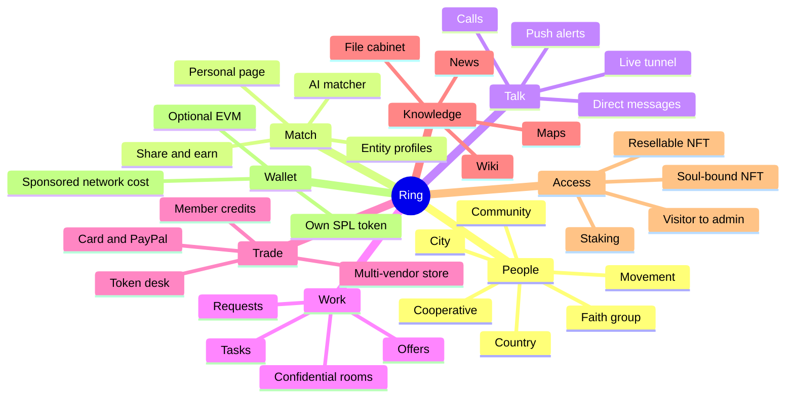

<p align="center">
  
</p>

<h1 align="center">Ring</h1>

<p align="center">
  Open-source software for a group that wants to match people with real chances — and leave the noise out.
</p>

<p align="center">
  <a href="https://ring-platform.org">Docs</a> ·
  <a href="web/README.md">Web app guide</a> ·
  <a href="https://ring-platform.org/changelog">Changelog</a> ·
  <a href="web/LICENSE">Apache 2.0</a>
</p>

<p align="center">
  
  
  
  
  
</p>

---

Ring is a full web platform you can copy and run yourself. You set the name. You set the rules. You keep the members.

The aim is simple. People should see work, goods, knowledge, and other people that fit them. They should not drown in ads and feed noise. When a match is real, they can act — talk, apply, buy, join, or vote.

Ray Sorkin built Ring in Ukraine. Guides live at [ring-platform.org](https://ring-platform.org). The runnable app is [`web/`](web/).

## Who Ring is for

You can run one ring for any group that needs a shared home:

| You serve | Ring can hold |
| --- | --- |
| A **community** | Members, events, a store, and a shared wiki |
| A **cooperative** | Shared work, shared sales, and shared rules |
| A **city** | Local offers, local needs, and local shops |
| A **country** | Many groups under one set of public rules |
| A **movement** | Campaigns, tasks, and gated rooms for trusted people |
| A **faith group** | Members, teaching, gifts, and access that can stay with the person |

One codebase. Many uses. You do not fork a new product for each kind of group.

## What Ring holds


```mermaid
mindmap
  root((Ring))
    People
      Community
      Cooperative
      City
      Country
      Movement
      Faith group
    Match
      AI matcher
      Entity profiles
      Personal page
      Share and earn
    Talk
      Direct messages
      Calls
      Live tunnel
      Push alerts
    Work
      Offers
      Requests
      Tasks
      Confidential rooms
    Trade
      Multi-vendor store
      Member credits
      Card and PayPal
      Token desk
    Knowledge
      Wiki
      News
      File cabinet
      Maps
    Access
      Visitor to admin
      Soul-bound NFT
      Resellable NFT
      Staking
    Wallet
      Own SPL token
      Sponsored network cost
      Optional EVM
```

Ring ships as one app with modules you can turn on. You do not glue ten products together.

- **Match** — An AI matcher finds people, offers, and requests that fit a profile.
- **Talk** — Live messages, calls, and a push tunnel so members hear what matters now.
- **Opportunities** — Post work, goods, and needs. Apply in the open or in a closed room.
- **Store** — Many vendors. Cart, orders, and member credits.
- **Knowledge** — A wiki, news, a file cabinet, and maps.
- **Wallet** — Members connect a wallet. The ring can run its own [Solana SPL](https://solana.com/docs/tokens) token.
- **Gates** — NFT access to rooms, shops, and roles. A gate can be soul-bound or it can allow resale.

Developer stack: React 19, Next.js 16, TypeScript, Tailwind 4, Auth.js v5. Clone this repo and self-host. See [web/README.md](web/README.md) for the module map, app layout, and setup.

## Wallet, token, and gates

Ring treats money and access as part of the same home, not as a bolt-on shop.

**Wallet.** A member connects a wallet. The ring can issue a custodial wallet on sign-in so a new person can start without a seed phrase.

**Own token.** Each ring can run its own SPL token on Solana. That token is a utility token for membership, gates, and loyalty — not a thing you must presell.

**No platform fee on native-token use.** The ring treasury can pay the network cost (gas) so members send and settle the native token without holding SOL. Ring does not add a second platform fee on those sponsored sends. You still set the token price for a membership or a gate. The public chain may charge a network cost when a send is not sponsored.

**NFT-gated access.** You can lock a room, a shop, or a role behind an NFT.

- **Soul-bound** — The pass stays with the person. They cannot sell it. Use this for membership and identity.
- **Resell rights** — The pass is a deed or a license. The holder can sell it when it is not staked. Use this for vendor keys and tradeable access.

Staking can lock a tradeable gate so it cannot move until the lock ends.

## Start here

```bash
git clone https://github.com/connectplatform/ring.git
cd ring
./install.sh
```

`install.sh` at the repo root runs the installer in `web/`.

If you already have Node.js and want a manual path:

```bash
cp web/env.local.template web/.env.local
npm install --prefix web
npm run dev
```

Then open the URL the installer prints (local default is `http://localhost:3000`).

Copy `web/ring-config.template.json` only if `web/ring-config.json` is missing. Set your name, locales, and feature flags in `web/ring-config.json`.

## Layout

| Path | What it is |
| --- | --- |
| [`web/`](web/) | The Next.js app — this is the product |
| [`web/install.sh`](web/install.sh) | Interactive install, database setup, and production hints |
| [`scripts/`](scripts/) | Setup helpers used by the installer |

The public command-line installer is `./install.sh`. You do not need extra private tooling to run a community ring.

## Docs and license

- Site and guides: [ring-platform.org](https://ring-platform.org)
- Web app README: [web/README.md](web/README.md)
- License: [Apache License 2.0](web/LICENSE)

You may copy Ring, change it, and run it for your group. Keep the license file.
