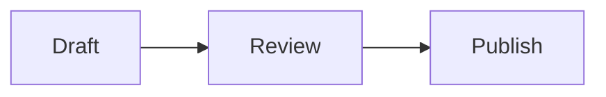

# Documentation components

Ring docs are **MDX files** rendered by `next-mdx-remote/rsc` with a shared component map in `components/docs/mdx-docs-shared.tsx`. Use these building blocks to write pages that work for **developers** (precise paths, code) and **executives** (outcomes, one diagram, clear navigation).

<Callout type="info">
  **Canonical paths:** Content lives at `docs/content/{locale}/library/{section}/{page}.mdx`. Public URLs omit `library` — e.g. `/docs/architecture`, `/docs/development/docs-components`.
</Callout>

## Render pipeline

<Mermaid title="Docs render path">
{`flowchart LR
  MDX["MDX + frontmatter"]
  RSC["next-mdx-remote/rsc"]
  GFM["remark-gfm"]
  Rehype["rehype: Code + Mermaid fences"]
  Map["docsMdxComponents map"]
  Page["/{locale}/docs/..."]

  MDX --> RSC
  GFM --> RSC
  Rehype --> RSC
  RSC --> Map --> Page`}
</Mermaid>

| Stage | Location | Role |
|-------|----------|------|
| Content | `docs/content/{locale}/library/` | `title`, `description`, MDX body |
| Resolver | `lib/docs/resolve-doc-file-path.ts` | Maps `/docs/foo` → `library/foo.mdx` |
| Components | `components/docs/mdx-docs-shared.tsx` | Registers all JSX tags below |
| Syntax | Shiki (`nord` / `tokyo-night`) | Server-side highlighting in `<Code>` |

## Component quick reference

| Component | Best for | Client / server |
|-----------|----------|-----------------|
| **Callout** | Executive summary, warnings (`DB_BACKEND_MODE`, legal) | Client |
| **Mermaid** | One system map + one sequence diagram per hub (avoid sprawl) | Client |
| **Tabs / Tab** | Developer vs Operator (or CEO) views on the same page | Client |
| **Cards / Card** | Hub navigation to all child articles | Server-friendly |
| **Steps / Step** | Install and deploy walkthroughs | Server-friendly |
| **Code** | Shiki-highlighted config snippets | Server (async) |
| **MindMap** | Concept trees — use sparingly on hubs | Client |
| **Timeline** | Release / migration history | Client |
| **RingAISynapseFlow** | Marketing / AI demos only — heavy bundle | Client |
| **CodeSandbox** | Runnable examples in `/examples` | Client |
| **Math / MathBlock** | Scientific editor, tokenomics equations | Client |

Fenced markdown code (\`\`\`typescript) and fenced mermaid (\`\`\`mermaid) are rewritten at build time to `<Code>` and `<Mermaid>` via rehype plugins.

## Callout

Types: `info` | `warning` | `error` | `success`. Optional `title`.

<Callout type="success" title="Executive summary pattern">
  Lead hub pages with a one-paragraph outcome for operators and CEOs, then tables and a single system diagram.
</Callout>

```mdx
<Callout type="warning" title="Security">
  Never commit `WAYFORPAY_SECRET_KEY` to the repository.
</Callout>
```

## Mermaid

Prefer **one** architecture map and **one** sequence diagram on hub pages. Additional diagrams belong on child articles.

<Mermaid title="Example sequence">
{`sequenceDiagram
  participant A as Author
  participant B as MDX
  participant C as Browser
  A->>B: Write Mermaid in template literal
  B->>C: Client hydrate + render SVG`}
</Mermaid>

```mdx
<Mermaid title="Payment flow">
{`sequenceDiagram
  User->>Ring: Checkout
  Ring->>WayForPay: Create session`}
</Mermaid>
```

Or a fenced block (converted automatically):



## Tabs and Tab

Split audiences without duplicating entire pages. Pass `items` or rely on child `<Tab value="…">` labels.

<Tabs items={['Developers', 'Operators']}>

<Tab value="Developers">

- Point to file paths (`lib/database/DatabaseService.ts`)
- Show Server Action and API contracts
- Link to canonical EN deep dives

</Tab>

<Tab value="Operators">

- Env var checklists and `DB_BACKEND_MODE`
- Deploy order, secrets, monitoring signals
- No implementation detail unless troubleshooting

</Tab>

</Tabs>

```mdx
<Tabs items={['Developers', 'Operators']}>

<Tab value="Developers">

Content for engineers.

</Tab>

<Tab value="Operators">

Content for deployers and CEOs.

</Tab>

</Tabs>
```

## Cards and Card

Required pattern for **section hub** pages (`index.mdx`). Each card links to a child page from that section's `meta.json`.

<Cards>
  <Card title="Architecture hub" href="/docs/architecture">
    System map, Tabs, and links to all architecture children
  </Card>
  <Card title="Backend modes" href="/docs/architecture/backend-modes-and-databases">
    Canonical `DB_BACKEND_MODE` reference
  </Card>
</Cards>

```mdx
<Cards>
  <Card title="Page title" href="/docs/section/page">
    Short description for the card body.
  </Card>
</Cards>
```

Use href `/docs/...` without the `library` segment. Locale prefix is applied by the app router.

## Steps and Step

<Callout type="warning" title="MDX syntax">
  **Blank lines are required** before `<Steps>`, before each `<Step>`, after each `</Step>`, and after `</Steps>`. Omitting them causes MDX parse errors.
</Callout>

<Steps>

<Step>

Install dependencies:

<Code language="bash" title="terminal">
{`cd ring-platform.org
npm install`}
</Code>

</Step>

<Step>

Add the page to `docs/content/en/library/{section}/meta.json` `pages[]` and mirror UK/RU `meta.json` when translating.

</Step>

<Step>

Verify at `http://localhost:3000/docs/{section}/{page}`.

</Step>

</Steps>

## Code

Server-rendered Shiki blocks. Prefer the `code` prop or template literal children:

<Code language="typescript" title="env example">
{`DB_BACKEND_MODE=k8s-postgres-fcm
POLYGON_RPC_URL=https://polygon-rpc.com`}
</Code>

```mdx
<Code language="bash" title="terminal">
{`npm run dev`}
</Code>
```

Inline code uses the markdown backtick form: `DatabaseService`, `auth()`.

## MindMap

Alias for Mermaid `mindmap` syntax. Use for concept hierarchies — **not** five mindmaps on one hub page.

<MindMap title="Docs section shape">
{`mindmap
  root((Hub page))
    Callout summary
    One Mermaid map
    Tabs audiences
    Cards children`}
</MindMap>

## Timeline

Client-only (`react-chrono`). Use for migration timelines and release notes.

```mdx
{/* Timeline expects items prop — use in dedicated client wrapper or examples */}
```

Document release history in prose + table if `Timeline` props are awkward in pure MDX; prefer Timeline on marketing or roadmap pages.

## RingAISynapseFlow

Animated AI-matching visualization. **Do not** embed on dense reference pages — large client bundle (Three.js / motion). Reserve for welcome, opportunities, or feature marketing docs.

## CodeSandbox and Math

| Component | When |
|-----------|------|
| **CodeSandbox** | `/examples` — Sandpack `react-ts` (or custom `files`) with live preview |
| **Math** | Inline KaTeX: `<Math>{`E = mc^2`}</Math>` |
| **MathBlock** | Display equations in scientific / tokenomics docs |

## Hub page checklist

Use this when rewriting section indexes (e.g. [Architecture](/docs/architecture)):

<Steps>

<Step>

**Executive Callout** — who the page is for and the deployment default (Postgres-primary, PaymentConductor, etc.).

</Step>

<Step>

**Capability table** — stack row per concern (data, auth, payments, realtime).

</Step>

<Step>

**One system Mermaid** — logical layers, not emoji sprawl.

</Step>

<Step>

**Tabs** — Developers vs Operators (or CEO vs engineering).

</Step>

<Step>

**Cards** — every entry in section `meta.json` `pages[]` except `index`.

</Step>

<Step>

**Cross-links** — customization, deployment env, LOCALE-GAPS policy for UK/RU.

</Step>

</Steps>

## Authoring rules

| Rule | Why |
|------|-----|
| EN canonical unless LOCALE-GAPS marks UK/RU summary | Avoid drift on env tables and API bodies |
| Frontmatter `title` + `description` required | SEO and docs sidebar |
| No `fumadocs-ui` imports | Migrated to Ring `components/docs/` |
| Test `npm run dev` after new MDX | Catch Steps blank-line and Mermaid typos early |
| Grep stale strings after stack bumps | e.g. `Next.js 16` in UK/RU backlog |

## Related

- [Contributing](/docs/development/contributing) — PR and content guidelines
- [Code structure](/docs/development/code-structure) — app layout vs `features/`
- [Architecture hub](/docs/architecture) — reference hub using these components
- Truth lens: `AI-LEGIOX/legiox-truth-lens/ring-docs-specialist.nodus.json`

<Callout type="info">
  After adding or restructuring docs, update `docs/content/LOCALE-GAPS.md` and run `legiox-context-update` when AI-CONTEXT should reflect new patterns.
</Callout>
