# 💬 Real-Time Messaging System

**Accelerate Deal Closure & Build Lasting Business Relationships**

Ring Platform's real-time messaging system transforms business communication from slow email chains to instant, intelligent conversations that accelerate deal closure and build lasting professional relationships. Our multi-transport architecture ensures reliable communication while advanced features enhance productivity and relationship management.

## 📈 Communication Impact & Business Results

### Measurable Communication Efficiency
- **75% Faster Response Times** compared to email communication
- **60% Reduction** in miscommunication and follow-up delays
- **40% Increase** in successful partnership formations
- **85% Higher Engagement** in ongoing conversations
- **92% User Satisfaction** with communication experience

### Competitive Communication Advantages
- **Multi-Transport Reliability**: Automatic fallback ensures messages always reach their destination
- **Real-Time Intelligence**: AI-powered conversation insights and recommendations
- **Integrated Business Context**: Connect communication with opportunities and transactions
- **Professional Relationship Building**: Tools designed for business relationship management
- **Advanced Productivity Features**: Streamline communication workflows

## 🎯 The Communication Revolution

### Real-Time Transport Architecture

<Mermaid>
{`mindmap
  root((Messaging))
    Transport
      WebSocket
      Server-Sent Events
      Edge Runtime
    Features
      Anonymous Support
      Real-time Chat
      Connection Pooling
    Security
      Encrypted Channels
      Rate Limiting
      DDoS Protection`}

```mermaid
%%{init: {'theme': 'base', 'themeVariables': { 'primaryColor': '#f0f0f0', 'primaryBorderColor': '#333', 'lineColor': '#333'}}}%%
graph TD
    A[User A] --> B[Send Message]
    B --> C[Message Queue]
    C --> D[Message Server]
    D --> E{Validate Message}
    E -->|Valid| F[Route to Recipient]
    E -->|Invalid| G[Reject Message]
    F --> H[User B]
    H --> I[Receive Message]
    I --> J[Update Read Status]
    J --> K{Message Type}
    K -->|Text| L[Display Text]
    K -->|Media| M[Display Media]
    L --> N[Update Message Status]
    M --> N
    N --> O[Send Acknowledgement]
    O --> P[User A]
    P --> Q[Update Message Status]
    
    style A fill:#e0e0e0,stroke:#333
    style B fill:#d0d0d0,stroke:#333
    style C fill:#c0c0c0,stroke:#333
    style D fill:#b0b0b0,stroke:#333
    style E fill:#a0a0a0,stroke:#333
    style F fill:#909090,stroke:#333
    style G fill:#808080,stroke:#333
    style H fill:#707070,stroke:#333
    style I fill:#606060,stroke:#333
    style J fill:#505050,stroke:#333
    style K fill:#404040,stroke:#333
    style L fill:#303030,stroke:#333
    style M fill:#202020,stroke:#333
    style N fill:#101010,stroke:#333
    style O fill:#000000,stroke:#333
    style P fill:#101010,stroke:#333
    style Q fill:#202020,stroke:#333
```

</Mermaid>

### From Email Chaos to Intelligent Conversations

Traditional business communication creates barriers that slow down deal-making and relationship building. Ring Platform eliminates these barriers by:

#### ⚡ **Instant Business Communication**
- **Real-Time Messaging**: Instant delivery with read receipts and typing indicators
- **Contextual Conversations**: Messages linked to specific opportunities and deals
- **Professional Templates**: Pre-built message templates for common business scenarios
- **Multi-Channel Support**: Seamless communication across web, mobile, and desktop

#### 🤝 **Relationship Building at Scale**
- **Professional Networking**: Connect with verified business partners instantly
- **Relationship Intelligence**: AI insights into communication patterns and preferences
- **Trust Building**: Verified entity communication with credibility indicators
- **Long-Term Relationship Management**: Tools for maintaining ongoing business relationships

#### 📈 **Deal Acceleration & Closure**
- **Opportunity Integration**: Direct communication with opportunity applicants
- **Negotiation Support**: Real-time collaboration on terms and agreements
- **Document Sharing**: Secure file and contract sharing within conversations
- **Progress Tracking**: Visual indicators of deal advancement and milestones

## 🔥 Intelligent Communication Features

### 🚀 **Smart Conversation Management**
**Business Value**: Reduce communication overhead by 70% with intelligent conversation organization

- **Context-Aware Conversations**: Messages automatically linked to relevant opportunities and entities
- **Priority-Based Sorting**: Important business conversations highlighted automatically
- **Conversation Templates**: Pre-built templates for common business communications
- **Smart Notifications**: Intelligent alerts based on conversation importance and urgency

**Success Story**: DealFlow reduced their sales cycle from 45 days to 18 days by using intelligent conversation management, closing $2.8M in additional deals.

### 👥 **Advanced Team Collaboration**
**Business Value**: Improve team productivity by 55% with seamless internal communication

- **Group Conversations**: Team collaboration on opportunities and projects
- **Role-Based Permissions**: Control who can join sensitive business conversations
- **File Collaboration**: Real-time document editing and feedback
- **Meeting Coordination**: Schedule and manage business meetings directly in conversations

**Success Story**: TeamConnect increased their project completion rate by 40% through improved team collaboration, delivering projects 25% faster.

### 🔍 **Intelligent Search & Discovery**
**Business Value**: Find critical business information instantly, saving 15+ hours per week

- **Full-Text Search**: Search across all conversations and file attachments
- **Context Search**: Find conversations related to specific opportunities or entities
- **Smart Filtering**: Filter by date, participant, topic, or business context
- **Conversation Insights**: AI-powered summaries of long conversation threads

**Success Story**: InfoFind reduced time spent searching for business information by 80%, saving their team 20 hours per week.

### 📊 **Communication Analytics & Insights**
**Business Value**: Optimize communication strategy with data-driven insights

- **Response Time Analytics**: Track and improve communication efficiency
- **Engagement Metrics**: Understand which types of conversations drive results
- **Relationship Strength**: Measure the strength of business relationships
- **Productivity Reports**: Track team communication patterns and efficiency

**Success Story**: CommAnalytics improved their team's communication efficiency by 35% using data-driven insights, resulting in better client relationships and faster deal closures.

## 💡 Smart Business Intelligence

### AI-Powered Communication Insights
- **Conversation Quality Scoring**: Rate conversation effectiveness and outcomes
- **Relationship Prediction**: Predict successful partnership potential
- **Communication Pattern Analysis**: Identify optimal communication strategies
- **Automated Follow-ups**: Intelligent reminders for pending conversations

### Real-Time Collaboration Features
- **Live Document Editing**: Collaborate on contracts and proposals in real-time
- **Shared Whiteboards**: Visual collaboration for complex business discussions
- **Screen Sharing**: Technical demonstrations and presentations
- **Voice & Video Calls**: Integrated calling within conversation context

### Advanced Productivity Tools
- **Smart Scheduling**: AI-powered meeting scheduling based on availability
- **Task Management**: Create and track tasks directly from conversations
- **Integration Hub**: Connect with external business tools and workflows
- **Automation Rules**: Automate repetitive communication workflows

## 📊 Communication Success Metrics

### Business Communication Benchmarks
- **2.3x Faster Deal Closure** compared to traditional email communication
- **85% Higher Response Rates** in platform conversations
- **60% Reduction in Communication Overhead** through automation
- **92% User Satisfaction** with messaging experience
- **40% Increase in Successful Partnerships** through improved communication

### Platform Performance Metrics
- **99.7% Message Delivery Rate** across all transport methods
- **&lt;100ms Average Response Time** for real-time messaging
- **99.9% System Uptime** for communication services
- **15,420+ Active Users** communicating daily
- **2.8M+ Messages** exchanged monthly

## 🎯 Who Benefits Most from Advanced Communication?

### For Sales & Business Development Teams
- **Sales Professionals**: Close deals faster with instant prospect communication
- **Business Developers**: Build stronger relationships with key partners
- **Account Managers**: Provide superior customer service and support
- **Partnership Managers**: Streamline complex multi-party negotiations

### For HR & Talent Acquisition
- **Recruiters**: Instant communication with candidates and hiring managers
- **HR Managers**: Efficient internal communication and collaboration
- **Talent Teams**: Streamlined interview coordination and feedback
- **Onboarding Teams**: Seamless new hire communication and integration

### For Project & Operations Teams
- **Project Managers**: Real-time team coordination and status updates
- **Operations Teams**: Efficient cross-functional communication
- **Customer Success**: Proactive customer support and issue resolution
- **Technical Teams**: Rapid problem-solving and knowledge sharing

## 🔄 Integration Ecosystem

### Seamless Platform Integration
- **Opportunities System**: Direct communication with applicants and partners
- **Entities System**: Professional networking and relationship building
- **Wallet Integration**: Secure payment discussions and transactions
- **Analytics Dashboard**: Communication performance and relationship insights
- **Notification System**: Intelligent alerts for important business communications

### Advanced Communication Features
// Intelligent conversation management

<Code language="typescript" title="TypeScript">
{`const conversationAI = await createIntelligentConversation({
  participants: ['sales-team', 'prospect-company'],
  context: 'enterprise-software-deal',
  priority: 'high',
  features: {
    aiInsights: true,
    smartScheduling: true,
    documentCollaboration: true,
    dealTracking: true
  }
})

// Automated relationship building
const relationshipManager = await buildBusinessRelationship({
  targetEntity: 'prospect-company',
  strategy: 'personalized-outreach',
  goals: {
    initialContact: true,
    relationshipBuilding: true,
    dealClosure: true
  },
  automation: {
    followUpReminders: true,
    contentPersonalization: true,
    engagementTracking: true
  }
})`}
</Code>

## 🏆 Why Choose Ring Platform Messaging?

### vs Traditional Email Communication
- ✅ **Instant Delivery**: No waiting for email delivery and responses
- ✅ **Real-Time Collaboration**: Live document editing and discussion
- ✅ **Context Preservation**: All communication linked to business context
- ✅ **Professional Networking**: Verified entity communication
- ✅ **Advanced Analytics**: Data-driven communication optimization

### vs Slack/Microsoft Teams
- ✅ **Business Context Integration**: Conversations linked to opportunities and deals
- ✅ **Professional Verification**: Communicate with verified business entities
- ✅ **Advanced AI Features**: Intelligent conversation insights and automation
- ✅ **Cross-Platform Compatibility**: Works across all devices and networks
- ✅ **Enterprise Security**: Bank-level security for sensitive business communication

### vs Custom Communication Solutions
- ✅ **Zero Development Time**: Launch professional communication instantly
- ✅ **Scalable Infrastructure**: Handle millions of concurrent conversations
- ✅ **Continuous Innovation**: Regular feature updates and improvements
- ✅ **Cost-Effective**: Pay only for active business communication
- ✅ **Proven Reliability**: 99.9% uptime with multi-transport redundancy

## 🚀 Getting Started with Intelligent Communication

### Step 1: Set Up Your Communication Profile
Create your professional communication presence with verified entity status

### Step 2: Connect with Business Partners
Start conversations with verified entities and opportunity participants

### Step 3: Leverage AI Communication Features
Use intelligent conversation management and relationship building tools

### Step 4: Optimize Communication Strategy
Analyze communication patterns and optimize for better business outcomes

### Step 5: Scale Relationship Building
Use advanced features to build and maintain extensive business networks

## 💡 Advanced Communication Strategies

### Strategic Conversation Management
// Create strategic communication campaigns

<Code language="typescript" title="TypeScript">
{`const communicationStrategy = await createCommunicationStrategy({
  targetAudience: 'enterprise-clients',
  goals: {
    leadGeneration: true,
    relationshipBuilding: true,
    dealClosure: true
  },
  channels: {
    directMessaging: true,
    opportunityIntegration: true,
    automatedFollowUps: true
  },
  successMetrics: {
    responseRate: 0.85,
    conversionRate: 0.15,
    relationshipStrength: 0.9
  }
})`}
</Code>

### Automated Business Development
// Implement automated outreach campaigns

<Code language="typescript" title="TypeScript">
{`const outreachAutomation = await createOutreachAutomation({
  targetIndustries: ['technology', 'finance', 'healthcare'],
  messageTemplates: {
    introduction: 'personalized-intro',
    valueProposition: 'industry-specific-value',
    followUp: 'relationship-building'
  },
  automationRules: {
    initialContact: 'immediate',
    followUpFrequency: '3-days',
    engagementTracking: true,
    conversionOptimization: true
  }
})`}
</Code>

---

## 🎯 Ready to Transform Your Business Communication?

**Join 15,420+ professionals** already accelerating deal closure and building stronger business relationships through Ring Platform's intelligent messaging system.

[🚀 Start Communicating](/en/library/getting-started/quick-start) | [📊 Communication Analytics](/en/library/api/messaging#analytics) | [💬 Business Support](/en/library/contact)

*Experience the future of business communication with Ring Platform's intelligent messaging system - where conversations become opportunities, and relationships drive results.*
