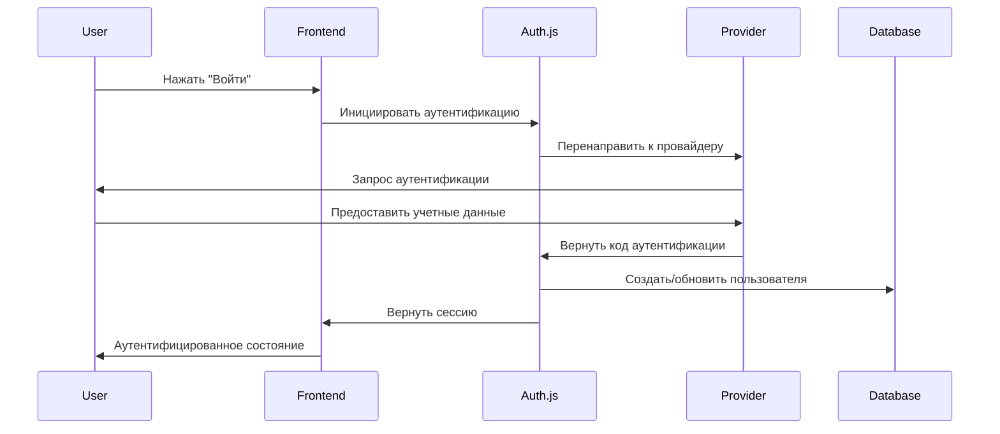

# API Аутентификации

Платформа Ring использует **Auth.js v5** для комплексной аутентификации с множеством провайдеров, включая OAuth, магические ссылки и крипто-кошельки.

## Обзор

**3 конечные точки** для управления аутентификацией:
- Аутентификация пользователей и управление сессиями
- Интеграция мульти-провайдерного OAuth
- Аутентификация через крипто-кошельки

## Поток Аутентификации



## Поддерживаемые Провайдеры

### OAuth Провайдеры
- **Google** - Основной OAuth провайдер
- **Apple** - Интеграция с iOS/macOS
- **MetaMask** - Аутентификация через крипто-кошелек

### Магические Ссылки
- **На базе Email** - Аутентификация без пароля
- **Безопасные токены** - Доступ с ограничением по времени
- **GDPR совместимо** - Приоритет приватности

## Конечные точки API

### `POST /api/auth/signin`
Инициировать аутентификацию с указанным провайдером

### `POST /api/auth/signout`
Выйти из системы и аннулировать сессию

### `GET /api/auth/session`
Получить информацию о текущей сессии пользователя

## Примеры реализации

### Аутентификация на стороне сервера

```typescript
import { auth } from '@/auth'

export default async function ProtectedPage() {
  const session = await auth()

  if (!session) {
    return <div>Пожалуйста, войдите в систему</div>
  }

  return <div>Добро пожаловать, {session.user.name}!</div>
}
```

### Аутентификация на стороне клиента

```typescript
'use client'
import { useSession } from 'next-auth/react'

export default function UserProfile() {
  const { data: session, status } = useSession()

  if (status === 'loading') return <div>Загрузка...</div>
  if (!session) return <div>Не аутентифицирован</div>

  return <div>Привет, {session.user.name}!</div>
}
```

### Контроль доступа на основе ролей

```typescript
import { auth } from '@/auth'

export default async function AdminPage() {
  const session = await auth()

  if (!session || session.user.role !== 'ADMIN') {
    return <div>Доступ запрещен</div>
  }

  return <div>Панель администратора</div>
}
```

## Иерархия ролей

Платформа Ring использует иерархическую систему ролей:

1. **VISITOR** - Только публичный доступ
2. **SUBSCRIBER** - Базовый доступ к платформе
3. **MEMBER** - Полные возможности платформы
4. **CONFIDENTIAL** - Доступ к конфиденциальным сущностям
5. **ADMIN** - Администрирование платформы

## Функции безопасности

- **JWT токены** с автоматическим обновлением
- **Защита от CSRF** встроена
- **Ограничение скорости** на конечных точках аутентификации
- **Безопасные куки** с флагом httpOnly
- **Соответствие GDPR** с удалением данных

---

*Нужна помощь с аутентификацией? Посмотрите наше руководство [Начало работы](/ru/library/getting-started) или присоединяйтесь к нашему [Discord](https://discord.gg/ring-platform).*
