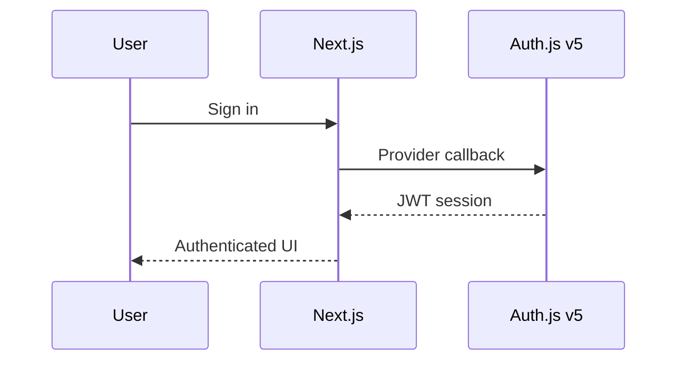

# Authentication (Auth.js v5)

- Providers: Google, Apple, Magic link, Crypto wallet
- JWT sessions with role-based access (VISITOR → CONFIDENTIAL → ADMIN)
- Unified status pages for auth workflows

