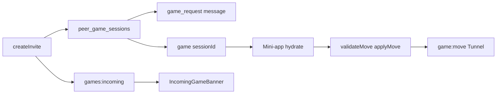

# Peer Games

<Callout type="info">
  Use **Founder** / **Developer** tabs in the docs sidebar to filter this page. Sidebar visibility is curated in `lib/docs/audience-curated-docs.ts`.
</Callout>

Ring ships **peer mini-games** that reuse Tunnel fan-out, the interactive-message kit, and public-profile IA — without a GameConductor, parallel messaging stack, or stakes.

| Surface | Path |
|---------|------|
| Marketplace | `/games` |
| Mini-app | `/games/[slug]?session=` |
| Public availability | `/{username}/games` |
| Owner manage | `/profile/games` (Member) |
| Chat widget | message type / `metadata.kind` = `game_request` |
| Incoming banner | MessagesShell **and** `/games` layout |

**Titles (shipped):** tic-tac-toe · chess · checkers. Catalog copy is localized via `locales/*/modules/games.json` (`modules.games`); English strings in `catalog.ts` remain FCM/history fallback.



<Audience for="founder">

## Why this matters for your clone

Members bond faster when they can **play** without leaving your Ring. Challenges land as chat widgets and as a global **IncomingGameBanner** on Messages and `/games` — so invites are not missed outside the messenger thread.

- Free **Member** perk — no Stars / credits / PaymentConductor stakes
- **Direct** conversations only (same gate as 1:1 calls)
- Call ↔ game **mutex** (cross-tab via BroadcastChannel): cannot accept a game while a call is active, and vice versa
- Public **Play with me** only offers slugs the peer enabled on `/{username}/games`
- Pending invites expire (15 minutes); idle active games clean up after 2 hours

### Operator checklist

1. Confirm membership so owners can open `/profile/games` and publish availability (chess / checkers / tic-tac-toe).
2. Smoke `/games` in each locale — catalog titles should localize (EN/UK/RU/ES/DE).
3. From a direct chat, compose a game challenge → peer sees banner **and** widget.
4. Accept → play moves → resign; both sides update without refresh.
5. Confirm Phone/Video call blocks game accept while the call overlay is live (try a second browser tab too).
6. Optional: leave a pending invite ~15 minutes (or run session-expiry cron) → banner and mini-app clear.

<Cards>
  <Card title="Messaging" href="/docs/features/messaging">
    Conversations and interactive widgets (`game_request` in the shared kit).
  </Card>
  <Card title="WebRTC Calls" href="/docs/features/webrtc-calls">
    Shared call/game mutex; ICE helper reused for optimistic DataChannel move hints.
  </Card>
  <Card title="Membership" href="/docs/features/subscriptions">
    Member gate for publishing availability and composing challenges.
  </Card>
  <Card title="Public Profile" href="/docs/features/public-profile">
    `/{username}/games` sits beside Player and Gallery on the public profile.
  </Card>
</Cards>

</Audience>

<Audience for="developer">

## Architecture

```text
createGameRequest / POST …/game-invite / challengeUserToGameAction
  → PeerGameService.createInvite (SSOT)
  → Redis SET NX claim peer-game:invite:{from}:{to}:{slug} (Map fallback)
  → create session (peer_game_sessions) FIRST
  → send game_request message → link messageId
  → on failure: delete session + releaseNx
  → publishToChannel(conversation:…, game:invite)
  → publishToUserTunnel(peer, games:incoming)
  → if !deliveredLive: sleep ~500ms; FCM GAME_REQUEST only if still !isUserConnected
accept / decline / resign / submitMove
  → participant ACL + plugin validateMove/applyMove
  → updateMessageLocked on linked widget metadata
  → game:* on game:{sessionId} AND conversation:{id}
  → decline/expire also publish terminal on games:incoming (banner clear)
client mini-app
  → hydrate DB SSOT → useTunnelChannel(game:{id})
  → optional RTCDataChannel optimistic hints (fetchIceServers); server remains SSOT
```

### Key modules

| Path | Role |
|------|------|
| `features/peer-games/service.ts` | Sessions + availability + createInvite SSOT |
| `features/peer-games/session-expiry.ts` | Orphan reclaim + pending/idle expiry |
| `features/peer-games/plugins/*-logic.ts` | Server-safe validate/apply (ttt, chess, checkers) |
| `features/peer-games/catalog.ts` | Slug registry (EN fallback) |
| `locales/*/modules/games.json` | Catalog + marketplace i18n (`modGames`) |
| `features/peer-games/lib/peer-game-mutex.ts` | Call/game busy + BroadcastChannel / Web Locks |
| `features/peer-games/lib/catalog-i18n.ts` | Localized title/description helpers |
| `features/peer-games/hooks/use-peer-game-datachannel.ts` | Optimistic move hints (`ring-peer-game-moves`) |
| `app/_actions/peer-games.ts` | Server actions |
| `app/api/conversations/[id]/game-invite/route.ts` | Thin HTTP twin → `createInvite` |
| `app/api/cron/peer-game-session-expiry/route.ts` | ProcessConductor pipeline |
| `app/api/tunnel/subscribe/route.ts` | HTTP `game:*` participant ACL |
| `lib/tunnel/native-ws/attach.ts` | WS `game:*` participant ACL (mirrors HTTP) |
| `IncomingGameBanner` | `games:incoming` + `game:{id}` lifecycle clear |

### Persistence

Migration **`data/migrations/043_peer_games.sql`**:

- `peer_game_sessions` — indexes on conversation / challenger / peer / status / slug / messageId / `updated_at`
- `user_peer_games` — per-owner `enabledSlugs` (unique on `ownerId`)

### Tunnel channels (verified)

| Channel | Events |
|---------|--------|
| `conversation:{id}` | `game:invite`, `game:accept`, `game:decline`, `game:resign`, `game:move`, `game:expire` |
| `game:{sessionId}` | `game:accept`, `game:decline`, `game:resign`, `game:move`, `game:expire`, `game:dc-signal` |
| user inbox | `games:incoming` (invite, `accepted`, `terminal`) |

**Subscribe ACL:** deny-by-default for `game:{sessionId}` on HTTP **and** native WS — only DB participants (`getSessionForParticipant`). Spectate deferred.

**Banner clear:** `game:expire` / `game:decline` / `game:accept` on the session channel, plus `games:incoming` with `terminal` or `accepted` (covers subscribe race after invite).

### Notifications & FCM

`NotificationType.GAME_REQUEST` / `GAME_UPDATED`. Offline push: after `!deliveredLive`, wait ~500ms and recheck `getTunnelHub().isUserConnected(peer)` before `createNotification` + FCM. Soft Web Audio chime on the banner only — never call ringtone / `setPeerCallBusy`.

<Callout type="warning">
  Hub `isUserConnected` is **process-local**. Multi-pod false offline FCM is a known residual — shared presence is backlog.
</Callout>

### Mutex, dedupe, boards

- Mutex: `setPeerCallBusy` / `setPeerGameBusy` with BroadcastChannel (+ optional `navigator.locks`)
- Invite dedupe: Redis `SET NX PX` **inside** `createInvite` (claim-before; `releaseNx` on failure) — Server Action + HTTP + Play-with-me share SSOT
- Chess: FEN SSOT (`key={fen}`); drops return `false`
- Checkers: English draughts, forced capture, **single jump per turn** (multi-jump backlog)

### Session expiry

Pipeline `peer-game-session-expiry`:

| Case | TTL | Result |
|------|-----|--------|
| Orphan pending (no `messageId`) | ~2m | Reclaim |
| Pending invite | 15m | Declined + `updateMessageLocked` |
| Active idle | 2h | Resigned/completed + Tunnel notify |

**Schedulers:** Vercel `*/5` (`vercel.json`) · k3s-or CronJobs `infrastructure/k3s-or/ring-platform-org/cronjob-peer-game-session-expiry.yaml` (+ sibling `cronjob-close-expired-polls.yaml`, `/bin/sh` so `CRON_SECRET` expands). Apply on cluster when promoting k8s prod.

### DataChannel (optimistic only)

`RTCDataChannel` label `ring-peer-game-moves` (ordered) + `fetchIceServers`. Peer envelopes are **hints**; `validateMove` / Tunnel `game:move` / DB remain SSOT. Reject → rollback to last authoritative hydrate. ICE restart under flaky nets is backlog; Tunnel path remains the fallback.

### Server actions

`createGameRequest` · `acceptGameRequest` · `declineGameRequest` · `resignPeerGameAction` · `submitPeerGameMoveAction` · `getPeerGameSessionAction` · `updateEnabledGamesAction` · `challengeUserToGameAction`

### Smoke / soak

Structural: `npx tsx scripts/smoke-peer-games-soak.cts`. Plugin unit tests under `__tests__/features/peer-games/plugins.test.ts`. Live Member E2E checklist: `AI-CONTEXT/concepts/peer-games-live-e2e-soak-2026-07-24.json` (empire Reggie propagate blocked until signoff).

</Audience>

## Related documentation

<RelatedDocs>
  <RelatedArticle
    slug="features/messaging"
    relation="Depends-on: game_request lives in the interactive-message kit and direct conversations."
  />
  <RelatedArticle
    slug="features/webrtc-calls"
    relation="Same-workflow: shared call/game mutex; ICE route reused for DataChannel move hints."
  />
  <RelatedArticle
    slug="features/tunnel-protocol"
    relation="Depends-on: conversation:*, game:{sessionId} ACL, and games:incoming fan-out."
  />
  <RelatedArticle
    slug="features/subscriptions"
    relation="Prerequisite: Member privileges gate /profile/games and challenge compose."
  />
  <RelatedArticle
    slug="features/public-profile"
    relation="Next-step: public /{username}/games beside Player and Gallery."
  />
  <RelatedArticle
    slug="features/push-notifications-fcm"
    relation="See-also: createInvite FCM GAME_REQUEST after Tunnel presence grace."
  />
  <RelatedArticle
    slug="features/notifications"
    relation="See-also: GAME_REQUEST and GAME_UPDATED preference types."
  />
</RelatedDocs>

<FutureFeatureBacklog title="Backlog — Peer Games (P2 + residual)">

<FutureFeatureWidget
  name="Live Member E2E signoff"
  description="Two-account staging/prod soak (enable → banner → moves → resign → expiry). Empire Reggie propagate stays blocked until green."
  implementationCost={8}
  labels={['peer-games', 'qa', 'soak']}
  poolSlug="peer-games-live-e2e-signoff"
/>

<FutureFeatureWidget
  name="Shared Tunnel presence for FCM"
  description="Multi-pod isUserConnected today is process-local — Redis/shared presence so offline FCM is accurate across replicas."
  implementationCost={24}
  labels={['peer-games', 'fcm', 'tunnel', 'redis']}
  poolSlug="peer-games-shared-presence-fcm"
/>

<FutureFeatureWidget
  name="Checkers multi-jump chains"
  description="English draughts multi-jump in one turn (validate/apply + board UX)."
  implementationCost={20}
  labels={['peer-games', 'checkers', 'plugins']}
  poolSlug="peer-games-checkers-multijump"
/>

<FutureFeatureWidget
  name="DataChannel ICE restart"
  description="iceRestart / connection recovery for flaky nets; Tunnel path remains fallback SSOT."
  implementationCost={16}
  labels={['peer-games', 'webrtc', 'datachannel']}
  poolSlug="peer-games-datachannel-ice-restart"
/>

<FutureFeatureWidget
  name="Transactional createInvite outbox"
  description="Full DB transaction / outbox so process death between createDoc and sendMessage cannot leave orphan sessions (TTL reaper already ships)."
  implementationCost={16}
  labels={['peer-games', 'postgres', 'reliability']}
  poolSlug="peer-games-invite-atomicity"
/>

<FutureFeatureWidget
  name="More titles: sea-battle, bingo"
  description="Additional free titles after checkers (plugin contract + catalog + tests)."
  implementationCost={36}
  labels={['peer-games', 'plugins']}
  poolSlug="peer-games-more-titles"
/>

<FutureFeatureWidget
  name="Matchmaking lobby + ELO + go"
  description="P2: queue, ratings, and Go title beyond direct invite."
  implementationCost={80}
  labels={['peer-games', 'matchmaking', 'elo']}
  poolSlug="peer-games-matchmaking-elo"
/>

<FutureFeatureWidget
  name="Stakes via PaymentConductor / WalletConductor / Stars"
  description="P2: escrow hold on accept; settle/refund on end — no parallel money path."
  implementationCost={64}
  labels={['peer-games', 'payments', 'stars']}
  poolSlug="peer-games-stakes"
/>

<FutureFeatureWidget
  name="Spectate, rematch, AI opponent"
  description="P2: read-only spectate ACL, rematch protocol, server-validated AI adapter."
  implementationCost={56}
  labels={['peer-games', 'spectate', 'ai']}
  poolSlug="peer-games-spectate-rematch-ai"
/>

<FutureFeatureWidget
  name="Group games / LiveKit"
  description="P2: >2 players with optional LiveKit AV; Tunnel+DB remain board SSOT."
  implementationCost={96}
  labels={['peer-games', 'livekit', 'group']}
  poolSlug="peer-games-livekit-group"
/>

<FutureFeatureWidget
  name="White-label peerGames.enabledSlugs"
  description="Empire: ring-config filter for catalog + invite guards; thin Reggie overlay only."
  implementationCost={16}
  labels={['peer-games', 'white-label']}
  poolSlug="peer-games-enabled-slugs"
/>

<FutureFeatureWidget
  name="Admin games analytics dashboard"
  description="Empire: invite/accept/complete KPIs and admin UI without PII leaks."
  implementationCost={32}
  labels={['peer-games', 'analytics', 'admin']}
  poolSlug="peer-games-admin-analytics"
/>

<FutureFeatureWidget
  name="Board a11y (keyboard + live region)"
  description="Empire: ARIA grid navigation and turn announcements for boards."
  implementationCost={20}
  labels={['peer-games', 'a11y']}
  poolSlug="peer-games-board-a11y"
/>

</FutureFeatureBacklog>
