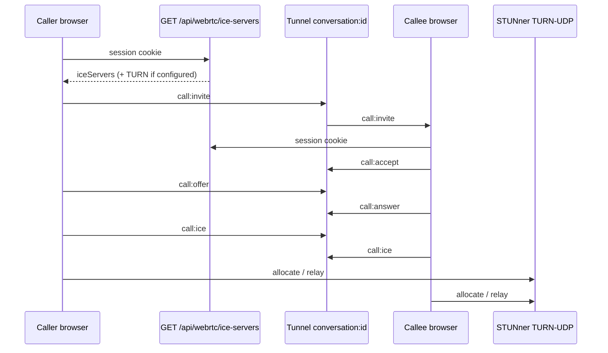

# WebRTC Calls & STUNner TURN

<Callout type="info">
  Use **Founder** / **Developer** tabs in the docs sidebar to filter this page. Sidebar visibility is curated in `lib/docs/audience-curated-docs.ts`.
</Callout>

Ring messenger can place **1:1 audio and video calls** inside a **direct** conversation. Signaling rides the existing **Tunnel** channel `conversation:{id}`. Media uses the browser `RTCPeerConnection`. NAT traversal uses **STUNner** (STUN/TURN) on the cluster, with ICE servers delivered by an **authenticated** API — credentials never ship in `NEXT_PUBLIC_*`.

| Layer | Role |
|-------|------|
| UI | Phone / Video on conversation header → full-screen call overlay |
| Signaling | Tunnel events `call:invite` … `call:hangup` on `conversation:{id}` |
| ICE | `GET /api/webrtc/ice-servers` (session required) |
| TURN | STUNner Gateway `TURN-UDP:3478` (e.g. `turn.ring-platform.org`) |

Related: [Messaging](/docs/features/messaging) · [Peer Games](/docs/features/peer-games) · [Tunnel Protocol](/docs/features/tunnel-protocol) · [Real-time architecture](/docs/architecture/real-time)

<Callout type="tip">
  Peer Games share a **call ↔ game mutex** (`features/peer-games/lib/peer-game-mutex.ts`). `MessagesShell` publishes `setPeerCallBusy` from the WebRTC phase so `/games` banner and `game_request` widgets refuse accept while a call is live. Cross-tab sync ships via **BroadcastChannel** (optional `navigator.locks`). Peer Games also reuse `GET /api/webrtc/ice-servers` for optimistic **DataChannel** move hints — Tunnel + DB remain board SSOT.
</Callout>

<Audience for="founder">

## Why this matters for your clone

Members close deals faster when they can **talk** without leaving your Ring. Calls stay inside the same conversation that already carries opportunity, entity, or store context.

<Cards>
  <Card title="Messaging" href="/docs/features/messaging">
    Conversations, groups, and Tunnel live chat.
  </Card>
  <Card title="Tunnel Protocol" href="/docs/features/tunnel-protocol">
    The realtime pipe calls reuse for invite / accept / hangup.
  </Card>
  <Card title="Self-hosted deploy" href="/docs/deployment/self-hosted">
    Where STUNner and env wiring live for k8s clones.
  </Card>
</Cards>

### Operator checklist (k3s / Ringdom cloud)

1. **STUNner** control plane installed (`stunner-system`) and Gateway programmed in namespace `stunner`.
2. Public UDP **3478** reachable (host firewall / cloud firewall).
3. DNS for TURN host (example production: `turn.ring-platform.org` A/AAAA → node LB IP).
4. App ConfigMap / Secret wired: `WEBRTC_STUN_URL`, `WEBRTC_TURN_URL`, `WEBRTC_TURN_USERNAME`, `WEBRTC_TURN_CREDENTIAL`.
5. Members use **direct** chats with Tunnel connected — Phone / Video appear in the header.

### Typical scenarios

- Two matched professionals jump from text to a short voice call without switching apps.
- A vendor clarifies an order face-to-face over video while the thread stays the SSOT.
- Strict NATs still connect because TURN relays via STUNner (when credentials are configured).

<Callout type="tip">
  Calls require a live Tunnel session. If realtime is disconnected, the UI refuses to start a call — fix Tunnel first ([Tunnel Protocol](/docs/features/tunnel-protocol)).
</Callout>

</Audience>

<Audience for="developer">

## Architecture



### Verified modules

| Path | Responsibility |
|------|----------------|
| `app/api/webrtc/ice-servers/route.ts` | Auth’d ICE config from `WEBRTC_*` env |
| `features/chat/lib/fetch-ice-servers.ts` | Client fetch via `apiClient` |
| `features/chat/lib/call-types.ts` | Signal event / payload types |
| `hooks/use-webrtc-call.ts` | `RTCPeerConnection` + Tunnel publish/subscribe |
| `features/chat/components/call-overlay.tsx` | Full-screen controls (mute / camera / end) |
| `features/chat/components/conversation-header.tsx` | Phone / Video actions (direct only) |
| `features/messages/components/messages-shell.tsx` | Wires hook + overlay |
| `infrastructure/k3s-or/stunner/` | GatewayClass, GatewayConfig, Gateway manifests |
| `k8s/ENV-PROD-WIRING.md` | Prod env table for `WEBRTC_*` |

### ICE API

`GET /api/webrtc/ice-servers` — requires Auth.js session (`401` if anonymous).

Response shape (verified):

```json
{
  "success": true,
  "data": {
    "iceServers": [
      { "urls": "stun:…" },
      { "urls": "turn:…", "username": "…", "credential": "…" }
    ],
    "turnConfigured": true
  }
}
```

STUN falls back to `stun:stun.l.google.com:19302` when `WEBRTC_STUN_URL` is unset. TURN is added only when **all** of `WEBRTC_TURN_URL`, `WEBRTC_TURN_USERNAME`, and `WEBRTC_TURN_CREDENTIAL` are set.

### Env vars (verified)

| Variable | Where | Notes |
|----------|--------|------|
| `WEBRTC_STUN_URL` | ConfigMap | Optional; Google STUN default in route |
| `WEBRTC_TURN_URL` | ConfigMap | e.g. `turn:turn.ring-platform.org:3478?transport=udp` |
| `WEBRTC_TURN_USERNAME` | Secret `ring-platform-org-secrets` | Matches STUNner auth Secret |
| `WEBRTC_TURN_CREDENTIAL` | Secret | **Never** `NEXT_PUBLIC_*` |

Examples: `k8s/secrets.example.yaml`, wiring notes: `k8s/ENV-PROD-WIRING.md`.  
`env.local.template` does **not** yet list these keys — use the k8s examples for local/prod parity.

### Tunnel signaling events

Published on channel `conversation:{conversationId}` (same channel as typing):

| Event | Purpose |
|-------|---------|
| `call:invite` | Outgoing ring |
| `call:accept` / `call:reject` | Callee decision |
| `call:offer` / `call:answer` | SDP |
| `call:ice` | ICE candidates |
| `call:hangup` | Tear down |

Subscribe with **`useTunnelChannel`** — do not raw-subscribe in effects ([Tunnel Protocol](/docs/features/tunnel-protocol)).

### STUNner install order (k3s-or)

<Steps>

<Step>

Install operator (pulls Gateway API + STUNner CRDs):

<Code language="bash">
{`export KUBECONFIG=/etc/rancher/k3s/k3s.yaml
helm repo add stunner https://l7mp.io/stunner && helm repo update
helm upgrade --install stunner stunner/stunner \\
  --create-namespace --namespace=stunner-system --wait`}
</Code>

</Step>

<Step>

Create auth Secret (`type=static`, `username`, `password`) and apply `infrastructure/k3s-or/stunner/gateway.yaml` (GatewayClass + GatewayConfig + Gateway with protocol **`TURN-UDP`**).

</Step>

<Step>

Wire app Secret/ConfigMap + ensure Deployment env refs for `WEBRTC_TURN_USERNAME` / `WEBRTC_TURN_CREDENTIAL` (`k8s/deployment.yaml`). Restart the app Deployment.

</Step>

<Step>

Smoke: external STUN Binding to `:3478`; authenticated `GET /api/webrtc/ice-servers`; two browsers on the same direct conversation.

</Step>

</Steps>

<Callout type="warning">
  Listener protocol must be **TURN-UDP**, not bare UDP. Realm in GatewayConfig is alphanumeric + hyphen (e.g. `ring-platform-org`). Empty UDPRoute `backendRefs` are invalid — peer TURN does not need a UDPRoute until an SFU (LiveKit) exists.
</Callout>

### Scope of the shipped MVP

- **In:** 1:1 direct audio/video; overlay controls; ICE via server route; STUNner TURN foundation.
- **Out (see backlog):** incoming call when the peer is not viewing that thread; group/multi-party; LiveKit SFU; call system messages; IPv6 TURN path hardening.

Connect Platform’s RTVS / FastTransponder stack is **not** ported — only control UX patterns (mute / camera / end) were absorbed.

</Audience>

## Backlog

<FutureFeatureBacklog title="WebRTC / calls — not shipped yet">

<FutureFeatureWidget
  name="Incoming call when elsewhere in the app"
  description="Ring / accept when the callee is not viewing that conversation — user-scoped Tunnel channel and optional FCM push."
  implementationCost={24}
  labels={["webrtc", "tunnel", "fcm"]}
/>

<FutureFeatureWidget
  name="Call system message in thread"
  description="Persist invite/missed/ended as conversation system messages via MessageService."
  implementationCost={8}
  labels={["messaging", "webrtc"]}
/>

<FutureFeatureWidget
  name="Group and multi-party calls"
  description="Mesh or LiveKit SFU with STUNner UDPRoute to media pods — beyond 1:1 direct."
  implementationCost={80}
  labels={["webrtc", "livekit", "stunner"]}
/>

<FutureFeatureWidget
  name="IPv6 TURN path"
  description="AAAA for turn host exists; UDP STUN over IPv6 timed out on k3s ServiceLB — dual-stack UDP LoadBalancer verification."
  implementationCost={12}
  labels={["stunner", "ipv6", "k8s"]}
/>

<FutureFeatureWidget
  name="Device picker and ICE restart"
  description="enumerateDevices for mic/cam; pc.restartIce on network changes; optional getDisplayMedia screen share."
  implementationCost={16}
  labels={["webrtc", "ux"]}
/>

<FutureFeatureWidget
  name="WEBRTC_* in env.local.template"
  description="Document local-dev WEBRTC_STUN_URL / TURN_* keys alongside k8s/secrets.example.yaml for clone parity."
  implementationCost={2}
  labels={["docs", "env"]}
/>

</FutureFeatureBacklog>

## Related documentation

<RelatedDocs>
  <RelatedArticle
    slug="features/messaging"
    relation="Depends-on: calls start from direct conversation headers in the messenger."
  />
  <RelatedArticle
    slug="features/peer-games"
    relation="Same-workflow: shared call/game mutex (BroadcastChannel); ICE route reused for optimistic DataChannel move hints."
  />
  <RelatedArticle
    slug="features/tunnel-protocol"
    relation="Depends-on: call:invite … call:hangup ride conversation:{id}."
  />
  <RelatedArticle
    slug="api/messaging"
    relation="See-also: conversation and typing HTTP contracts."
  />
  <RelatedArticle
    slug="architecture/real-time"
    relation="Deep-dive: TunnelProvider ownership and consumers."
  />
</RelatedDocs>
