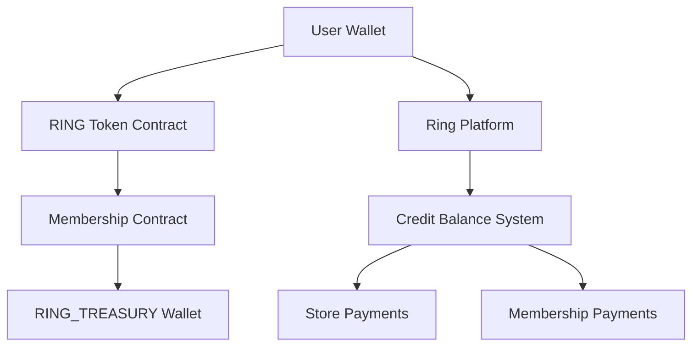

# RING Token Membership Payment Implementation Plan

## Overview

This plan implements RING token-based membership fees and credit balance system for the Ring platform, building upon existing wallet, store, and Auth.js v5 infrastructure.

## Current Architecture Analysis

### Existing Infrastructure
- **Auth System**: Auth.js v5 with role hierarchy (VISITOR < SUBSCRIBER < MEMBER < CONFIDENTIAL < ADMIN)
- **Wallet Service**: EVM-compatible wallet creation, balance checking, transfers (`ring/services/wallet/`)
- **Store System**: Adapter-driven catalog, cart, checkout (`ring/features/store/`)
- **Payment Service**: Stripe integration (`ring/services/store/payments-service.ts`)
- **Firebase Backend**: User profiles, orders, transactions storage
- **Web3 Integration**: Daarion integration scaffold (`ring/integrations/daarion/`)

### User Profile Schema Extension Required
Current user profile needs `credit_balance` field:
```typescript
interface UserProfile {
  // ... existing fields
  credit_balance?: {
    amount: string;        // RING tokens (as string for precision)
    usd_equivalent: string; // USD equivalent at last transaction
    last_updated: Timestamp;
    transaction_history: CreditTransaction[];
  }
}

interface CreditTransaction {
  id: string;
  type: 'payment' | 'airdrop' | 'reimbursement' | 'purchase' | 'membership_fee';
  amount: string;
  usd_rate: string;
  timestamp: Timestamp;
  description: string;
  tx_hash?: string; // For blockchain transactions
}
```

## Implementation Phases

### Phase 1: Smart Contract Development (P0)

#### 1.1 RING Token Contract
**File**: `ring/contracts/RingToken.sol`
```solidity
// ERC20 token with membership subscription functionality
contract RingToken {
  // Standard ERC20 functionality
  // Automatic subscription deduction (1 RING/month to RING_TREASURY)
  // Whitelist for membership subscribers
  // Emergency pause functionality
}
```

#### 1.2 Membership Subscription Contract
**File**: `ring/contracts/RingMembership.sol`
```solidity
// Handles automatic monthly deductions
contract RingMembership {
  // Subscribe user for automatic payments
  // Process monthly deductions (1 RING -> RING_TREASURY)
  // Handle subscription status (active/expired/cancelled)
  // Emit events for Ring platform integration
}
```

#### 1.3 Smart Contract Integration Service
**File**: `ring/services/blockchain/ring-contract-service.ts`
```typescript
export class RingContractService {
  // Deploy contracts to Polygon
  // Interact with RING token and membership contracts
  // Monitor subscription events
  // Handle contract upgrades
}
```

### Phase 2: Credit Balance System (P0)

#### 2.1 User Credit Service
**File**: `ring/services/wallet/user-credit-service.ts`
```typescript
export class UserCreditService {
  // Get user credit balance
  // Add credits (airdrop, reimbursement, top-up)
  // Deduct credits (purchase, membership fee)
  // Get transaction history
  // Convert RING to USD at current rate
}
```

#### 2.2 Credit Balance API Endpoints
**Files**:
- `ring/app/api/wallet/credit/balance/route.ts` - GET balance
- `ring/app/api/wallet/credit/history/route.ts` - GET transaction history  
- `ring/app/api/wallet/credit/topup/route.ts` - POST add credits
- `ring/app/api/wallet/credit/spend/route.ts` - POST spend credits

#### 2.3 Database Schema Updates
**File**: `ring/lib/firebase/user-schema.ts`
```typescript
// Extend user collection schema
// Add credit_balance subcollection for transaction history
// Update user profile converter for credit fields
```

### Phase 3: RING/USD Conversion Service (P0)

#### 3.1 Price Oracle Integration
**File**: `ring/services/blockchain/price-oracle-service.ts`
```typescript
export class PriceOracleService {
  // Integrate with Chainlink price feeds
  // Get current RING/USD rate
  // Cache rates with TTL
  // Handle rate fluctuations
  // Fallback price sources
}
```

#### 3.2 Price API Endpoints
**Files**:
- `ring/app/api/prices/ring-usd/route.ts` - GET current RING/USD rate
- `ring/app/api/prices/conversion/route.ts` - POST convert amounts

### Phase 4: Subscription Management (P1)

#### 4.1 Subscription Service
**File**: `ring/services/membership/subscription-service.ts`
```typescript
export class SubscriptionService {
  // Create subscription (smart contract interaction)
  // Check subscription status
  // Process manual membership payments
  // Handle subscription cancellation
  // Monitor blockchain events
}
```

#### 4.2 Subscription API Endpoints
**Files**:
- `ring/app/api/membership/subscription/create/route.ts` - POST create subscription
- `ring/app/api/membership/subscription/status/route.ts` - GET subscription status
- `ring/app/api/membership/subscription/cancel/route.ts` - POST cancel subscription
- `ring/app/api/membership/payment/ring/route.ts` - POST pay with RING tokens

#### 4.3 Membership Upgrade Flow Integration
**File**: `ring/components/membership/MembershipUpgradeModal.tsx`
```tsx
// Add RING token payment option
// Show current RING balance
// Display RING/USD conversion
// Handle insufficient balance scenarios
```

### Phase 5: Store Integration (P1)

#### 5.1 Store Payment Adapter
**File**: `ring/features/store/adapters/ring-payment-adapter.ts`
```typescript
export class RingPaymentAdapter implements PaymentAdapter {
  // Process RING token payments
  // Handle partial RING + fiat payments
  // Integrate with existing cart/checkout flow
  // Update order records with payment method
}
```

#### 5.2 Enhanced Store Payment Service
**File**: `ring/services/store/payments-service.ts` (extend existing)
```typescript
// Add RING token payment methods:
// - processRingPayment(orderId, ringAmount, usdRate)
// - processHybridPayment(orderId, ringAmount, fiatAmount)
// - validateTokenBalance(userId, requiredAmount)
```

#### 5.3 Checkout UI Updates
**Files**:
- `ring/components/store/checkout/PaymentMethodSelector.tsx` - Add RING option
- `ring/components/store/checkout/RingPaymentForm.tsx` - RING payment form
- `ring/app/[locale]/store/checkout/page.tsx` - Integration

### Phase 6: UI Components & Hooks (P2)

#### 6.1 Credit Balance Components
**Files**:
- `ring/components/wallet/CreditBalance.tsx` - Balance display
- `ring/components/wallet/CreditHistory.tsx` - Transaction history
- `ring/components/wallet/TopUpModal.tsx` - Add credits modal
- `ring/components/wallet/RingToUsdConverter.tsx` - Rate display

#### 6.2 Custom Hooks
**Files**:
- `ring/hooks/use-credit-balance.ts` - Credit balance management
- `ring/hooks/use-ring-price.ts` - RING/USD rate fetching
- `ring/hooks/use-subscription.ts` - Subscription status management
- `ring/hooks/use-ring-payment.ts` - Payment processing

#### 6.3 Profile & Wallet UI Updates
**Files**:
- `ring/app/[locale]/profile/wallet/page.tsx` - Show RING balance
- `ring/components/wallet/WalletOverview.tsx` - Credit balance section
- `ring/components/navigation/UserBalance.tsx` - Quick balance display

### Phase 7: Admin & Monitoring (P3)

#### 7.1 Admin Dashboard
**Files**:
- `ring/app/[locale]/admin/ring-tokens/page.tsx` - Token management
- `ring/app/[locale]/admin/subscriptions/page.tsx` - Subscription monitoring
- `ring/components/admin/RingTokenDashboard.tsx` - Analytics

#### 7.2 Event Monitoring Service
**File**: `ring/services/blockchain/event-monitor-service.ts`
```typescript
// Monitor smart contract events
// Process subscription payments
// Handle failed transactions
// Alert system integration
```

## Technical Implementation Details

### Smart Contract Architecture



### API Endpoint Summary

| Endpoint | Method | Purpose | File |
|----------|---------|---------|------|
| `/api/wallet/credit/balance` | GET | Get user credit balance | `ring/app/api/wallet/credit/balance/route.ts` |
| `/api/wallet/credit/history` | GET | Get transaction history | `ring/app/api/wallet/credit/history/route.ts` |
| `/api/wallet/credit/topup` | POST | Add credits to balance | `ring/app/api/wallet/credit/topup/route.ts` |
| `/api/wallet/credit/spend` | POST | Spend credits | `ring/app/api/wallet/credit/spend/route.ts` |
| `/api/prices/ring-usd` | GET | Current RING/USD rate | `ring/app/api/prices/ring-usd/route.ts` |
| `/api/prices/conversion` | POST | Convert RING to USD | `ring/app/api/prices/conversion/route.ts` |
| `/api/membership/subscription/create` | POST | Create subscription | `ring/app/api/membership/subscription/create/route.ts` |
| `/api/membership/subscription/status` | GET | Check subscription status | `ring/app/api/membership/subscription/status/route.ts` |
| `/api/membership/payment/ring` | POST | Pay membership with RING | `ring/app/api/membership/payment/ring/route.ts` |

### Database Schema Updates

#### User Profile Extension
```typescript
// Add to existing user document in Firestore
{
  // ... existing user fields
  credit_balance: {
    amount: "0",
    usd_equivalent: "0",
    last_updated: serverTimestamp(),
    subscription_active: false,
    subscription_contract_address: null,
  }
}
```

#### New Collections
```typescript
// users/{userId}/credit_transactions
{
  id: string;
  type: 'payment' | 'airdrop' | 'reimbursement' | 'purchase' | 'membership_fee';
  amount: string;
  usd_rate: string;
  usd_equivalent: string;
  timestamp: Timestamp;
  description: string;
  tx_hash?: string;
  order_id?: string;
}

// ring_subscriptions
{
  userId: string;
  contract_address: string;
  status: 'active' | 'expired' | 'cancelled';
  created_at: Timestamp;
  last_payment: Timestamp;
  next_payment: Timestamp;
}
```

### Environment Variables Required

```env
# Smart contract addresses (after deployment)
RING_TOKEN_CONTRACT_ADDRESS=0x...
RING_MEMBERSHIP_CONTRACT_ADDRESS=0x...
RING_TREASURY_WALLET_ADDRESS=0x...

# Chainlink price feed (RING/USD)
CHAINLINK_RING_USD_FEED=0x...

# Ring token configuration
MEMBERSHIP_FEE_RING=1
SUBSCRIPTION_INTERVAL_DAYS=30
```

### Integration Points with Existing Systems

#### Auth.js v5 Integration
- Extend user session with credit balance
- Add RING balance to auth middleware
- Update role upgrade flows to accept RING payments

#### Store System Integration
- Extend `PaymentMethodSelector` with RING option
- Update order schema to track RING payments
- Modify `payments-service.ts` for hybrid payments

#### Websocket/Realtime Integration
- Push balance updates via tunnel transport
- Real-time subscription status updates
- Transaction confirmations

## Risk Mitigation & Security

### Smart Contract Security
- Multi-signature treasury wallet
- Pausable contracts for emergency stops
- Rate limiting on subscription creation
- Slippage protection on price conversions

### Platform Security  
- Server-side balance validation
- Transaction idempotency keys
- Rate limiting on payment endpoints
- Audit trails for all credit transactions

### Backup & Recovery
- Off-chain balance mirroring
- Transaction replay capabilities
- Emergency credit restoration procedures

## Testing Strategy

### Smart Contract Testing
- Unit tests for all contract functions
- Integration tests with Polygon testnet
- Gas optimization testing
- Security audit preparation

### Platform Testing
- API endpoint testing with Jest
- UI component testing with React Testing Library
- E2E payment flow testing with Playwright
- Performance testing under load

## Deployment Plan

### Phase 1: Testnet Deployment
1. Deploy contracts to Polygon Mumbai testnet
2. Deploy Ring platform changes to staging
3. Integration testing with test RING tokens
4. User acceptance testing

### Phase 2: Mainnet Deployment
1. Security audit of smart contracts
2. Deploy contracts to Polygon mainnet
3. Gradual rollout with feature flags
4. Monitor system performance and user adoption

## Success Metrics

- Monthly active users with RING subscriptions
- Average credit balance per user  
- Store payment method distribution (RING vs fiat)
- Subscription renewal rates
- Transaction success rates
- User satisfaction with RING payment flows

## Future Enhancements

- RING staking rewards for subscribers
- Bulk membership payments for organizations
- Cross-chain RING token support
- DeFi yield farming integration
- NFT membership benefits
