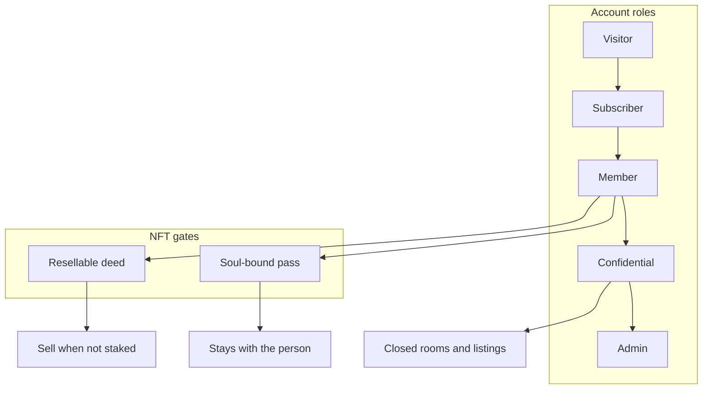
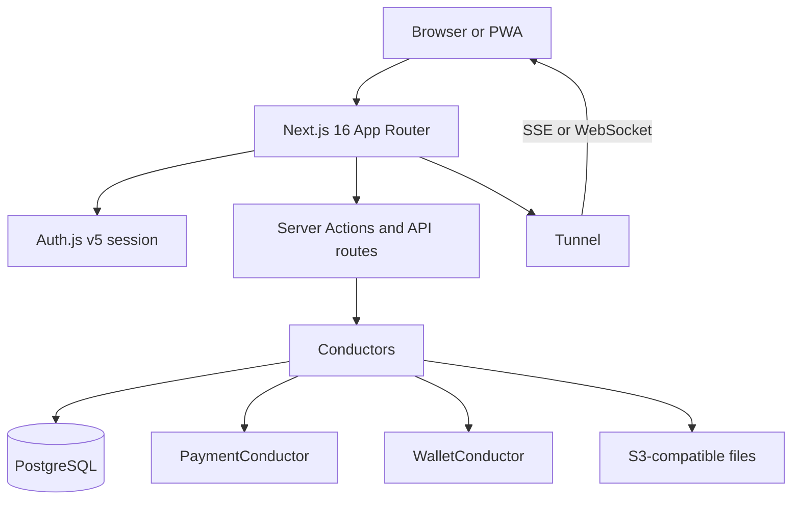
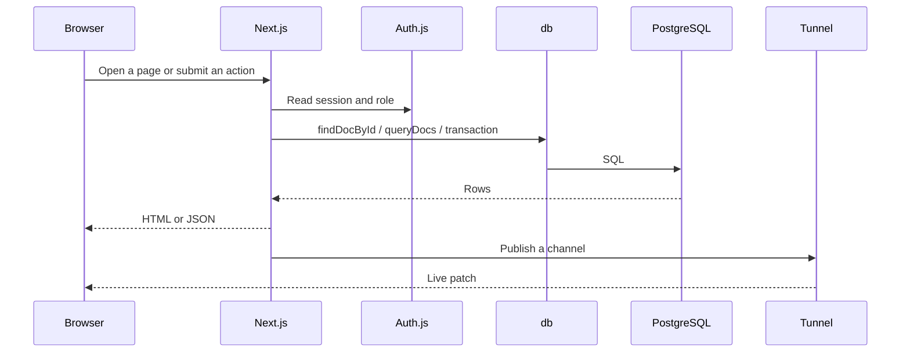
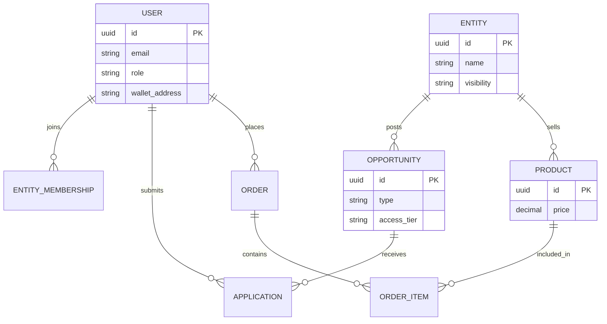

<p align="center">
  
</p>

<h1 align="center">Ring web</h1>

<p align="center">
  The Next.js app inside the Ring repository. Copy the repo, run this folder, and host your own ring.
</p>

<p align="center">
  <a href="../README.md">What Ring is</a> ·
  <a href="#web-modules">Modules</a> ·
  <a href="#how-a-request-moves">How it runs</a> ·
  <a href="#quick-start">Quick start</a> ·
  <a href="LICENSE">Apache 2.0</a>
</p>

<p align="center">
  
  
  
  
  
  
  
</p>

---

This folder is the product: a React 19 + Next.js 16 App Router site with PostgreSQL, Auth.js v5, a live tunnel, a store, a wiki, a wallet, and NFT gates.

Ring is not only a networking portal. Any group can copy it and run it — a community, a cooperative, a city, a country, a movement, or a faith group. The [root README](../README.md) states that purpose. This file states how the **web app** is built and what you turn on.

Guides: [ring-platform.org](https://ring-platform.org) · changelog: [ring-platform.org/changelog](https://ring-platform.org/changelog) · origin: Ray Sorkin, Ukraine.

## Web modules

Each row is a `features/` module (or a close pair). You enable most of them with `ring-config.json` and env, not with a new repo.

| Area | What members use |
| --- | --- |
| **Auth** | Google, Apple, email OTP / magic link / password, phone OTP, wallet sign-in, PIN wallet, KYC |
| **Entities** | Group and vendor profiles, showcase pages, industry presets, inquiries |
| **Opportunities** | Offers and requests, budgets, apply flow, public / member / confidential rooms |
| **Store** | Multi-vendor catalog, cart, orders, credits, card and PayPal through PaymentConductor |
| **Wallet** | Custodial or connected wallet, credit balance, native SPL token, Token Desk, staking |
| **NFT gates** | Soul-bound membership passes; resellable deeds and licenses; market when unstaked |
| **Messages and chat** | Direct messages, interactive cards, RTC calls |
| **Notifications** | In-app, web push, FCM |
| **Tunnel** | Live updates over SSE and WebSocket (optional Postgres fan-out on many replicas) |
| **Wiki** | Shared knowledge pages and media |
| **News** | CMS, revisions, locales, newsletter hooks |
| **File cabinet** | Files, galleries, public profile media |
| **Search and matcher** | Filters plus AI matcher for people, offers, and goods |
| **Maps** | Interactive maps; optional PostGIS nearby search |
| **Email CRM** | Inbox, threads, tasks, AI assist for operators |
| **Tasks** | Work items and escrow-style flows |
| **Peer games** | Lightweight games between members |
| **AI agents** | Vendor-attached agents (DAGI) |
| **Generative media** | Image and media helpers behind credits or gates |
| **Personal page** | Page builder, pins, share-and-earn links |
| **Admin** | Users, roles, store, news, CRM, NFT mint |

Locales in this tree: English, Ukrainian, Russian, Spanish, German (`locales/`).

## Roles and NFT gates

Roles are the account ladder. NFT gates are extra locks on rooms, shops, and tools. A member can hold both.



| Role | Typical access |
| --- | --- |
| **Visitor** | Public pages |
| **Subscriber** | Signed-in content |
| **Member** | Post, buy, join an entity |
| **Confidential** | Closed listings and closed entities |
| **Admin** | Operate the ring |

| Gate | Transfer |
| --- | --- |
| **Soul-bound** | No sale. Use for membership and identity. |
| **Resell rights** | Sale allowed when the pass is not staked. Use for vendor keys and licenses. |

Staking can freeze a tradeable gate until the lock ends. The ring treasury can sponsor native-token network cost so members do not need to hold SOL. See the [root README](../README.md#wallet-token-and-gates).

## How a request moves





Domain code uses `db()` from `lib/database/DatabaseService.ts` (`findDocById`, `queryDocs`, `createDoc`, `updateDoc`, `deleteDoc`, `transaction`). PostgreSQL is the production store. Other backends exist for special deploys; start with Postgres.

## App layout

```
web/
├── app/                 # App Router: [locale] pages, api/, _actions/
├── features/            # Product modules listed above
├── components/          # Shared UI
├── lib/                 # DatabaseService, tunnel, payments, auth helpers, conductors
├── locales/             # next-intl messages
├── data/schema.sql      # Database schema
├── ring-config.json     # Name, flags, token and NFT settings
├── env.local.template   # Environment keys
└── install.sh           # Install, database setup, production hints
```

Set brand and feature flags in `ring-config.json`. Use `ring-config.template.json` only when that file is missing.

## Stack

| Layer | This app uses |
| --- | --- |
| UI | Next.js 16 App Router, React 19, TypeScript, Tailwind 4 |
| Auth | Auth.js v5 |
| Data | PostgreSQL, JSONB, optional PostGIS |
| Live | Tunnel (SSE / WebSocket; optional Postgres LISTEN/NOTIFY) |
| Pay | PaymentConductor — credits, card processors you configure, PayPal |
| Chain | Solana SPL native token, Metaplex Core gates; optional EVM via wagmi |
| Files | S3-compatible object storage |
| i18n | next-intl |
| Maps | @xyflow/react plus optional map pages |

You self-host. A reverse proxy and a Postgres instance are enough for a first ring. Kubernetes and edge hosts are optional, not required.

## Quick start

From the **repository root** (recommended):

```bash
git clone https://github.com/connectplatform/ring.git
cd ring
./install.sh
```

From **this folder** after a clone:

```bash
cp env.local.template .env.local
# set AUTH_SECRET, NEXTAUTH_URL, and Postgres keys
npm install
npm run dev
```

Open `http://localhost:3000`. `install.sh` can also create the database from `data/schema.sql`.

### Scripts you will use

```bash
npm run dev          # Next.js + tunnel websocket when not on a serverless target
npm run build        # Type-check, then production build
npm run start        # Production server
npm run type-check
npm run lint
npm run test
```

Root `npm run dev` / `npm run build` call the same app.

### Environment

Copy `env.local.template` and fill only what you run:

- **Auth** — `AUTH_SECRET`, `NEXTAUTH_URL`, optional Google / Apple keys
- **Database** — Postgres host, name, user, password (or `DATABASE_URL`)
- **Tunnel** — `RING_DEPLOY_TARGET=self-hosted` for native WebSocket
- **Files** — S3-compatible keys, or skip until you need uploads
- **Pay** — processor keys only if the store charges cards
- **Web3** — WalletConnect project id, Solana RPC, optional fee-payer for sponsored mints

Do not commit `.env.local`.

## Data model (core)



Wallet ledgers, NFT purchases, news, wiki pages, and CRM threads sit beside this core. See `data/schema.sql`.

## Security (operator checklist)

- Rate-limit auth and API at your proxy.
- Allow only your site origin. Do not use a wildcard CORS policy.
- Bind sessions to Auth.js JWT settings in this app. Rotate `AUTH_SECRET`.
- Verify payment webhooks with HMAC on the server.
- Keep fee-payer and processor secrets off the client.

## Contribute

See [CONTRIBUTING.md](CONTRIBUTING.md). License: [Apache License 2.0](LICENSE).

## Links

- Purpose of Ring: [../README.md](../README.md)
- Docs: [ring-platform.org](https://ring-platform.org)
- GitHub: [github.com/connectplatform/ring](https://github.com/connectplatform/ring)
